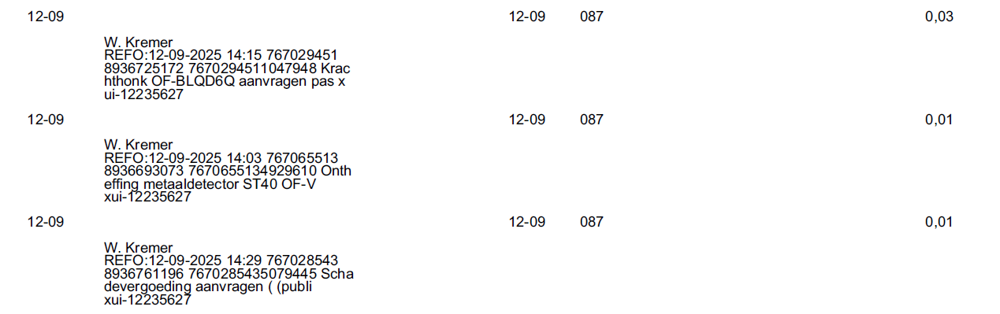
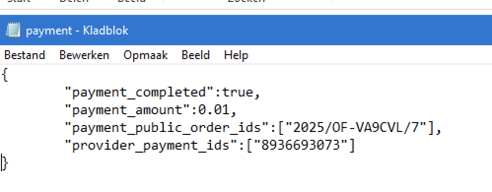

# OpenFormulieren - Betalingen

Betalingen worden opgesteld binnen Open Formulieren en met een inzending meegestuurd naar de desbetreffende opslaglocatie. De informatie van een betaling zal als text bestand worden toegevoegd aan de inzending map. Hiermee kan o.a. de afdeling Financien de details inzien van een betaling gerelateerd aan een bepaalde inzending.

## Route van de betaling (excl. JZ/VIP)

### Open Formulieren
Binnen de configuratie van een Open Formulieren formulier wordt aangegeven of er een betaling verplicht is bij een inzending. In Open Formulieren staat deze setting bekend als 'Payment Backend'. In de payment backend moet het Product, de Betaal Provider, en de Betaal Logica worden ingesteld. Als dit het geval is wordt de informatie van een betaling vanuit het formulier meegestuurd bij de inzending.

### Verwerking
Deze Open-Forms applicatie zal vervolgens de inzending oppakken en de relevante data verwerken. Zo wordt de payment data in een text bestand gezet en in een S3 bucket geplaats. Dit proces is identiek aan het opslaan van kvk of bsn informatie.

### Inzicht bij afdeling
Een payment.txt zal vervolgens beschikbaar zijn voor de afdeling naast de inzending en eventuele andere bijlages. De locatie is voorlopig ongewijzigd, wat betekent dat de bestanden op de netwerkschijf worden opgeslagen.

## Informatie op netwerkschijf
De volgende informatie wordt gedeeld met financien. Dit is nodig voor financien om de betaling gerelateerd aan de inzending verder te verwerken.

Informatie die financien ontvangt:

Informatie beschikbaar op netwerkschijf (payments.txt):

## Betalingen JZ/VIP
Voor VIP (en later ook voor JZ) wordt een andere route gebruikt voor betalingen. Inzending van VIP hebben een appId VIP-betalen als er een betaling aanhangt. Het achterliggende VIP systeem (van WoWeb) die de inzending gaat verwerken weet hiermee dat er ook een betaling verwerkt moet worden.