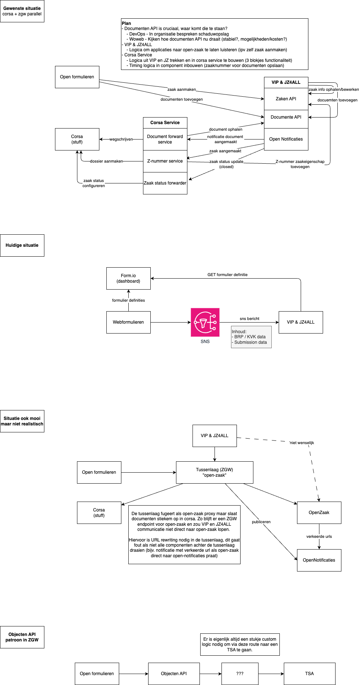

# Corsa en ZGW koppeling

## Doel/resultaat
Als VJB (IZ&L op termijn) wil ik aanvragen uit open-formulieren in TSAs laten landen via de ZGW-standaarden met behoud van archivering in Corsa.

## Voorgestelde oplossing 

VIP en JZ4ALL maken gebruik van corsa voor het archiveren van documenten. Dit levert vrijwfing op met de zaakgerichtwerken standaarden (ZGW-standaarden) waarop de VIP en JZ4ALL koppelingen (webformuliern, mijn-nijmegen) gebaseerd zijn.

De oplossing bestaat uit een extra (te ontwikkelen) service die documenten uit de documenten opslag (ZGW-standaard) doorstuurt naar corsa. Dit gebeurt op basis van events (ook onderdeel van de ZGW-standaard).

Hiervoor zijn er 3 zaken die de koppeling moet kunnen doen:
1) Een zaak starten in corsa (z-nummer aanmaken)
2) Documenten uit de ZGW documenten opslag doorsturen naar Corsa.
3) Zaak status in corsa up-to-date houden met de ZGW zaak.

Hoe dit werkt is in meer detail uitgetekend in de afbeelding hieronder.

### 2 Fases

    Fase 1: Documenten vanuit ZGW documenten opslag in Corsa opslaan via de ZaakDMS Corsa API.
    Fase 2: de ZaakDMS koppeling van de servcie vervangen door de process API laag van corsa.

De eerste fase is gericht op het werkend krijgen van het component. Hierbij herbruiken we onderdelen die reeds zijn ontwikkeld, maar onderdeel zijn van VIP en JZ4ALL. Deze zullen worden losgetrokken en in een eigen event-based (ook wel notificaties in ZGW termpen) service worden geplaatst. Dit zou dus snel moeten kunnen gebeuren. In deze service zal ook logica zitten om timingsproblemen in events af te vangen (bijv. een corsa dossier moet eerst aangemaakt zijn voor er documenten toegevoegd kunnen worden). Deze fase is belangrijk om optijd van formio af te zijn voor de licentie verloopt.

De tweede fase is gericht op het ombouwen van de service naar een meer geschiktere API laag van de ZaakDMS adapter (de process laag ipv de experience laag). Dit om flexibel te blijven richting de toekomst.

### Archivering & documentbeheer

Met deze service worden documenten opgeslagen in corsa, hier is archivering goed ingericht. Omdat de documenten voor de applicatie & integratie met bijvoorbeeld mijn-nijmegen ook worden opgeslagen in de ZGW documenten API is het noodzakelijk hier archivering ook goed in te richten. Dit is onderdeel van de ZGW-standaard en het component dat de API bied implementeert de afscherming op basis van vertouwijkheid en bewaartermijnen.

Documenten toevoegen in Corsa aan een dossier is niet mogelijk. Momenteel worden documenten niet in VIP en JZ4all opgepakt wanner ze via corsa aan een dossier zijn toegevoegd. Dit blijft onveranderd met de Corsa ZGW service.

## Motivatie

Deze intake is geboren uit de noodzaak om de form.io naar VIP/JZ4ALL koppeling te herzien in verband met de migratie naar open-formulieren. Hierbij is samen met Woweb (leverancier VIP en JZ4ALL) gekeken naar hoe dit momenteel werkt, de ideaale oplossing en beheerlast voor DevOps. Hier is de bovenstaande oplossing uitgkomen.

- De koppeling met open-formulieren moet voor 1 september herzien zijn (ivm verlopen formio licentie). Inplaats van een specifieke oplossing te laten ontwikkelen door DevOps zetten we in op standaard Open-formulieren functionaliteit met gebruik van de ZGW-standaard. We voorzien dat dit patroon (ZGW & Corsa) vaker zal voorkopmen.

- De voorgestelde Corsa ZGW service is een component dat open-source ontwikkeld zal worden en dus op meerdere plekken ingezet kan worden. We voorzien een aantal use cases in DDSD (IIT & ALO) waar wordt ingezet op gebruik van de ZGW-standaard maar corsa ook relevant is.

- Door de integratie met corsa uit VIP en JZ4ALL te halen, maken we deze applicatie minder nijmegen specifiek en vergoten we de kans dat deze bij andere gemeenten kan worden afgenomen.

- De Corsa ZGW service stelt ons in staat om de bestaande bedrijfsprocessen die op corsa vertrouwen niet te verhinderen maar toch door te kunnen ontwikkelen/innoveren aan de ZGW kant. Zo kunnen we mijn-nijmegen aansluiten doormiddel van ZGW-standaarden zonder een specifieke corsa integratie te bouwen.