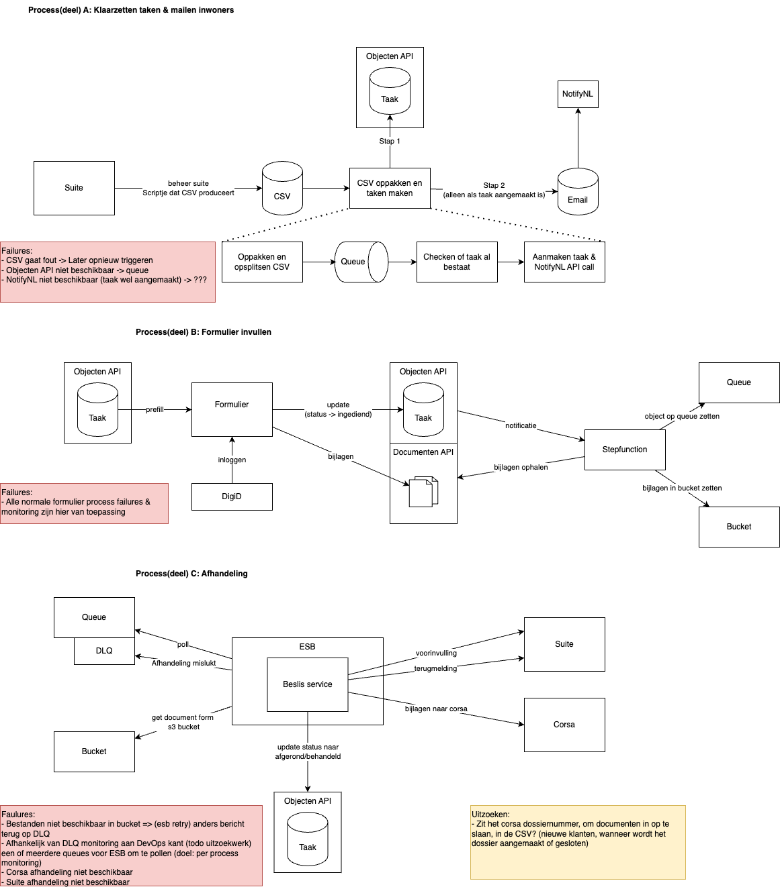
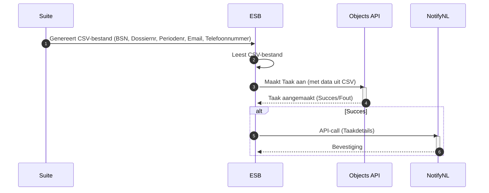
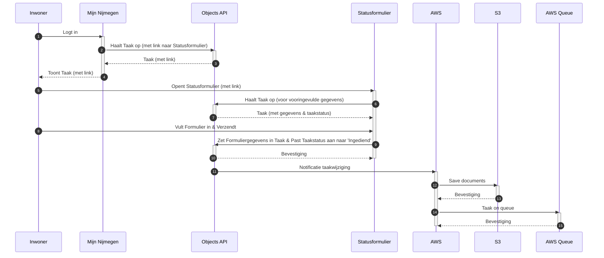
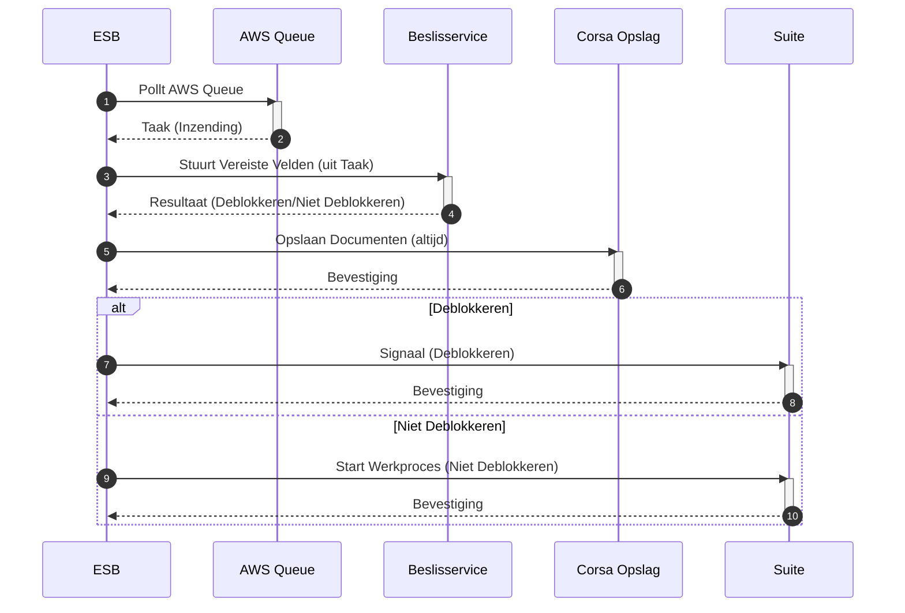

# ESF flows en data-formats:

We onderscheiden 3 processen in het ESF:
1. Klaarzetten nieuwe taken
2. Indienen formulier
3. Verwerken formulier in suite + corsa

Procesplaat:


## A. Klaarzetten nieuwe taken
Maandelijks wordt een lijst uitgedraaid van deelnemers aan het elektronisch statusformulier. Op dit moment wordt de uitkering ook geblokkeerd.
Deze wordt voor de ESB klaargezet in CSV-format. 
Dit bestand bevat:
- BSN
- Dossiernr
- Periodenr
- E-mail
- Telefoonnummer (optioneel?)

Op basis van deze lijst worden taken klaargezet. Taken zijn technisch `objecten` in de `[object-api](https://mijn-services.nijmegen.nl/objects/api/v2/schema/)`.
De objecten bevatten alle relevante informatie.



## B. Indienen formulier
De inwoner logt in op Mijn Nijmegen, waar de taak voor de inwoner klaarstaat. Deze bevat een verwijzing naar het statusformulier. Met deze link wordt
het statusformulier geopend, met vooringevuld de juiste gegevens uit de taak. De inwoner vult het formulier in en verzendt deze.

De ingezonden formuliergegevens worden door Open Forms in de taak gezet.
Op basis hiervan gaat een notificatie af (van objects API naar AWS):
- Een notificatie wordt op een queue gezet, waar de ESB op pollt, documenten worden in S3 gezet die in deze notificatie staat
De taakstatus wordt hierbij aangepast naar 'ingediend' door Open Forms



## C. Verwerken inzending
De ESB pakt de inzending op (afh. van keuze, ofwel van queue of adhv notificatie vanuit taak) en verwerkt deze. De **beslisservice** bepaalt of de 
uitkering kan worden gedeblokkeerd, adhv. antwoorden. Dit bepaalt wat in suite/corsa moet worden aangemaakt. (Gelijk aan oude opzet). Hierbij:
- Moeten documenten opgehaald (uit S3 of ZGW documenten)
- Moet gecontroleerd worden of contactinfo gewijzigd is (email/telefoonnr)
- Moet de taakstatus aangepast naar 'verwerkt' (TODO: Check naamgeving statussen)


## Taken aanmaken:
Taken worden opgeslagen als 'object'. De [object-api](https://mijn-services.accp.nijmegen.nl/objects/api/v2/schema/) bepaalt dit. 

In de acceptatieomgeving is deze API beschikbaar op https://mijn-services.accp.nijmegen.nl/objects/api/v2 Het relevante objecttype is daar `https://mijn-services.accp.nijmegen.nl/objecttypes/api/v2/objecttypes/6df21057-e07c-4909-8933-d70b79cfd15e`

Bij het aanmaken van een taak (Proces A stap 3) doe je een [POST naar /objects](https://mijn-services.accp.nijmegen.nl/objects/api/v2/schema/#tag/objects/operation/object_create) met een object in het juiste format:. Daarbij zijn van belang:
'titel': Dit krijgt de inwoner te zien
'status': Start 'open' (mogelijkheden: "open", "afgerond", "verwerkt", "gesloten")

In `formtaak.data` wordt prefill-data (dossiernr, periode, email, telefoon) opgenomen. **TODO:** samen bepalen welke velden nodig zijn in de prefill.

In `formtaak.verzonden_data` zit na het indienen door inwoner (Proces B stap 9) de relevante informatie na het indienen. **TODO:** Samen bepalen welke gegevens gestructureerd beschikbaar moeten zijn, en welke in de PDF-inzending voor de afdeling. (Opmerkingen hoeven vermoedelijk niet machine-readable te zijn).

<details>
    <summary>objectvoorbeeld</summary>

```json
    {
            "type": "https://mijn-services.accp.nijmegen.nl/objecttypes/api/v2/objecttypes/6df21057-e07c-4909-8933-d70b79cfd15e",
            "record": {
                "typeVersion": 3,
                "data": {
                    "soort": "formtaak",
                    "titel": "Statusformulier invullen",
                    "status": "open",
                    "eigenaar": "nijmegen",
                    "formtaak": {
                        "formulier": {
                            "soort": "url",
                            "value": "https://formulier.accp.nijmegen.nl/statusformulier"
                        },
                        "data": {
                            "dossiernummer": "dossier-test-1",
                            "periodenummer": "202506",
                            "email": "test@example.com",
                            "telefoon": "1234567890"
                        }
                    },
                    "koppeling": {
                        "uuid": "4c9b685d-3a9c-4216-9bb8-cac7fb2456e1",
                        "registratie": "zaak"
                    },
                    "verloopdatum": "2025-05-21 00:00:00",
                    "identificatie": {
                        "type": "bsn",
                        "value": "900026236"
                    },
                    "verwerker_taak_id": "client_task"
                },
                "geometry": null,
                "startAt": "2025-05-26",
                "endAt": null,
                "registrationAt": "2025-05-26",
                "correctionFor": null,
                "correctedBy": null
            }
        }
```

</details>

<details>
    <summary>Objectdefinitie (JSON Schema)</summary>

```json
{
  "type": "object",
  "$defs": {
    "url": {
      "type": "object",
      "required": [
        "uri"
      ],
      "properties": {
        "uri": {
          "type": "string",
          "format": "uri"
        }
      },
      "description": "Een link naar een externe resource. Als hier op deze taak geklikt word, word de gebruiker doorgestuurd naar deze link",
      "additionalProperties": false
    },
    "soort": {
      "enum": [
        "url",
        "formtaak",
        "ogonebetaling"
      ],
      "type": "string",
      "description": "Soort taak. Bijhorende taak specifieke informatie staat in een object met dezelfde naam in deze json"
    },
    "formtaak": {
      "type": "object",
      "required": [
        "formulier"
      ],
      "properties": {
        "data": {
          "$ref": "#/$defs/esfTaakData"
        },
        "formulier": {
          "oneOf": [
            {
              "type": "object",
              "properties": {
                "soort": {
                  "const": "url"
                },
                "value": {
                  "type": "string",
                  "format": "uri"
                }
              }
            },
            {
              "type": "object",
              "properties": {
                "soort": {
                  "const": "id"
                },
                "value": {
                  "type": "string"
                }
              }
            }
          ],
          "description": "Identificatie van bijhorend (formIO) formulier. Kan URL zijn voor externe opslag of ID voor locale opslag."
        },
        "verzonden_data": {
          "$ref": "#/$defs/esfTaakVerzondenData"
        }
      },
      "description": "Een taak die uitgevoerd kan worden binnen het desbetreffende portaal",
      "additionalProperties": false
    },
    "esfTaakData": {
      "type": "object",
      "required": [
        "dossiernummer",
        "periodenummer",
        "email"
      ],
      "properties": {
        "email": {
          "type": "string"
        },
        "telefoon": {
          "type": "string"
        },
        "dossiernummer": {
          "type": "string"
        },
        "periodenummer": {
          "type": "string"
        }
      },
      "description": "Data die benodigd is om het ESF te verwerken"
    },
    "ogonebetaling": {
      "type": "object",
      "required": [
        "bedrag",
        "betaalkenmerk",
        "pspid"
      ],
      "properties": {
        "pspid": {
          "type": "string"
        },
        "bedrag": {
          "type": "number",
          "minimum": 0,
          "multipleOf": 0.01
        },
        "betaalkenmerk": {
          "type": "string"
        }
      },
      "description": "Een betaling die via het portaal met Ogone / Ingenico wordt voldaan",
      "additionalProperties": false
    },
    "esfTaakVerzondenData": {
      "type": "object",
      "required": [
        "email",
        "telefoon",
        "inkomstengewijzigd",
        "woonsituatiegewijzigd",
        "vakantiegewijzigd",
        "studiegewijzigd",
        "vrijwilligerswerkgewijzigd",
        "vermogengewijzigd"
      ],
      "properties": {
        "email": {
          "type": "string"
        },
        "telefoon": {
          "type": "string"
        },
        "studiegewijzigd": {
          "enum": [
            "jaGestartMetStudie",
            "jaGestoptMetStudie",
            "nee"
          ],
          "type": "string"
        },
        "vakantiegewijzigd": {
          "enum": [
            "ja",
            "nee"
          ],
          "type": "string"
        },
        "vermogengewijzigd": {
          "enum": [
            "ja",
            "nee"
          ],
          "type": "string"
        },
        "inkomstengewijzigd": {
          "enum": [
            "ja",
            "nee"
          ],
          "type": "string"
        },
        "woonsituatiegewijzigd": {
          "enum": [
            "ja",
            "nee"
          ],
          "type": "string"
        },
        "vrijwilligerswerkgewijzigd": {
          "enum": [
            "jaGestartMetVrijwilligerswerk",
            "jaGestoptMetVrijwilligerswerk",
            "nee"
          ],
          "type": "string"
        }
      },
      "description": "Ingezonden data vanuit het ESF",
      "additionalProperties": true
    }
  },
  "title": "ObjectType Taak",
  "examples": [
    {
      "url": {
        "uri": "https://google.com"
      },
      "soort": "formtaak",
      "titel": "Check loan",
      "status": "open",
      "eigenaar": "gzac-sd",
      "formtaak": {
        "data": {
          "voornaam": "Jan",
          "achternaam": "Smit",
          "toestemming": true,
          "geboortedatum": "01-01-1970"
        },
        "formulier": {
          "soort": "url",
          "value": "http://localhost:8010/api/v2/objects/4e40fb4c-a29a-4e48-944b-c34a1ff6c8f4"
        },
        "verzonden_data": {
          "voornaam": "Jan",
          "achternaam": "Smit",
          "toestemming": false,
          "geboortedatum": "01-01-1971"
        }
      },
      "koppeling": {
        "uuid": "5551a7c5-4e92-43e6-8d23-80359b7e22b7",
        "registratie": "zaak"
      },
      "verloopdatum": "2023-09-20T18:25:43.524Z",
      "identificatie": {
        "type": "bsn",
        "value": "82395551"
      },
      "ogonebetaling": {
        "pspid": "MyID",
        "bedrag": 147.43,
        "betaalkenmerk": "abcdef1234"
      },
      "additional_fields": {
        "attachments": [
          {
            "url": "s3://bucketname/{taakid}/attachment1.pdf",
            "title": "attachment1"
          },
          {
            "url": "s3://bucketname/{taakid}/attachment2.jpg",
            "title": "attachment2"
          }
        ]
      },
      "verwerker_taak_id": "18af0b6a-967b-4f81-bb8e-a44988e0c2f0"
    }
  ],
  "required": [
    "titel",
    "status",
    "soort",
    "identificatie",
    "verwerker_taak_id",
    "eigenaar"
  ],
  "properties": {
    "url": {
      "$ref": "#/$defs/url"
    },
    "soort": {
      "$ref": "#/$defs/soort"
    },
    "titel": {
      "type": "string",
      "description": "Weergave naam van de taak. Max 1 zin"
    },
    "status": {
      "enum": [
        "open",
        "afgerond",
        "verwerkt",
        "gesloten"
      ],
      "type": "string",
      "description": "Status van de taak. Open: Taak kan worden gestart. Afgerond: Taak is uitgevoerd door gebruiker maar nog niet verwerkt. Verwerkt: Taak is verwerkt door ZAC. Gesloten: Taak is gearchiveerd."
    },
    "eigenaar": {
      "type": "string",
      "description": "Een identificatie van de eigenaar / aanmaker van de taak. Gebruikt voor filtering ed."
    },
    "formtaak": {
      "$ref": "#/$defs/formtaak"
    },
    "koppeling": {
      "type": "object",
      "properties": {
        "uuid": {
          "type": "string",
          "format": "uuid"
        },
        "registratie": {
          "enum": [
            "zaak",
            "product"
          ],
          "type": "string"
        }
      },
      "description": "Optioneel: Zaak of Product UUID waaraan de taak verbonden is",
      "additionalProperties": false
    },
    "verloopdatum": {
      "type": "string",
      "format": "date-time",
      "description": "Optioneel: Verloopdatum van de taak"
    },
    "identificatie": {
      "type": "object",
      "properties": {
        "type": {
          "type": "string"
        },
        "value": {
          "type": "string"
        }
      },
      "description": "KVK of BSN waaraan de taak gericht is. Kan uitgebreid worden met andere types"
    },
    "ogonebetaling": {
      "$ref": "#/$defs/ogonebetaling"
    },
    "additional_fields": {
      "type": "object",
      "properties": {
        "attachments": {
          "description": "array met objecten met een title en url property"
        }
      },
      "description": "Extra velden die niet in de standaard specificatie staan",
      "additionalProperties": true
    },
    "verwerker_taak_id": {
      "type": "string",
      "format": "uuid",
      "description": "Een UUID waarmee een ZAC een link kan leggen tussen de taak en zijn eigen administratie"
    }
  },
  "additionalProperties": false
}
```

</details>
