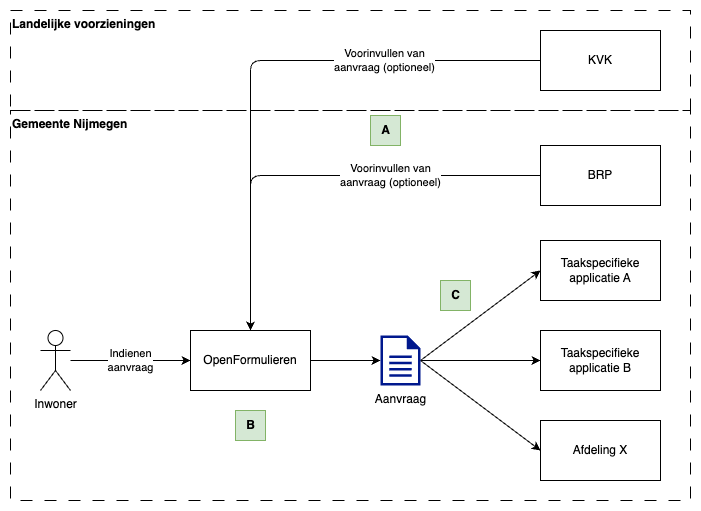

# OpenFormulieren - Gegevensverwerking

> [!IMPORTANT]  
> Dit is geen officiele DPIA die beoordeeld wordt door de functionaris gegevensbescherming.
> Dit document geeft slechts een overzicht van de gegevens, toegang tot de gegevens en risicos. 

## Applicatie in het process
De OpenFormulieren applicatie is het startpunt van veel processen binnen de organisatie.

- A. Bij het starten van een aanvraag kan het zijn dat er data uit een taakspecifieke applicatie vooringevuld wordt. Een voorbeeld hiervan is het ophalen van de BRP gegevens van een inwoner of de KVK gegevens van een ondernemer.
- B. Bij het invullen van een formulier wordt een kopie bijgehouden binnen de OpenFormulieren applicatie.
- C. Als het formulier verzonden wordt door de inwoner zorgt de OpenFormulieren applicatie er voor dat dit op de jusite plek in de organisatie wordt afgeleverd.

Een aantal gegevens van de huidige formulieren applicatie (de voorganger van OpenFormulieren)
| Gegeven                              | Aantal |
| ------------------------------------ | ------ |
| Gemiddeld aantal aanvragen per week* | 750    |
| Formulieren in productie             | 118    |
\* berekend over de afgelopen 3 maanden (jan 2025)

## Gegevens
Voor elke aanvraag worden gegevens geregistreerd, afhankelijk van het formulier en het process zal dit andere data zijn.
De meest voorkomende categorien zijn:
- BRP gegevens: Naam, Adres, Woonplaats
- KVK gegevens: Bedrijfsnaam, Vestigingsnummer, Adres, PseudoID

Het karakter van de verwerking van persoonsgegevens is dus een eenmalige uitwisseling.

Of er bijzondere persoonsgegevens worden gebruikt is afhankelijk van het proces.

Gegevens worden uitsluitend binnen de EER verwerkt. OpenFormulieren is een SaaS applicatie, zie ook de verwrkingsovereenkomst met Maykin.

##  Informatiebeveiliging en vernietiging

### Hoe lang worden de gegevens bewaard?
Omdat OpenFormulieren slechts als startpunt voor veel processen fungeert wordt archivering volgens de richtlijnen voor betreffende processen gedaan.
Data retantie vind alleen plaats bij onderdeel `B` in bovenstaand diagram, dit is altijd tijdelijk. In de onderstaande tabel wordt voor de drie soorten verschillende inzendingen aangegeven wat de bewaartermijnen zijn.

| Soort inzending      | Bewaartermijn | Toelichting                                                                                               |
| -------------------- | ------------- | --------------------------------------------------------------------------------------------------------- |
| Succesvol afgeleverd | 7 dagen       | Na aflevering bij op de juiste plek in de organisatie worden gegevens uiteindelijk volledig verwijderd    |
| Incomplete inzending | 7 dagen       | Als een inzending niet is afgemaakt of tussentijds opgeslagen wordt deze uiteindelijk volledig verwijderd |
| Fout bij inzending   | 30 dagen      | Als er een fout ontstaat bij het verwerken van een inzending worde deze uiteindelijk volledig verwijderd  |
| Alle inzendingen     | 90 dagen      | Na 90 dagen wordt elke inzending altijd verwijderd* |

\* Inzendingen kunnen ook deels verwijderd worden, dan wordt de gevoelige data uit de inzending verwijderd. Dit is voor geen categorie ingeschakeld en dus zullen alle inzendingen al ruim voor deze 90 dagen worden verwijderd.

### Wie is verantwoordelijk voor de vernietiging van de gegevens?
Dit wordt automatisch gedaan door OpenFormulieren afhanklijk van de bovenstaande bewaartermijnen.

### Hoe worden de gegevens beveiligd? Hoe is het toezicht daarop georganiseerd? 
Welke technische en organisatorische maatregelen zijn nu al genomen om de gegevens te beveiligen en risico’s voor betrokkenen te voorkomen of te beperken? Denk hierbij aan autorisaties, validatie etc. Benoem ook of gegevens herleidbaar, gepseudonimiseerd of geanonimiseerd worden opgeslagen. 

Wat wij als organisatie doen:
- Onderscheid tussen formulier bouwers en beheerders. Formulierbouwers hebben standaard geen toegang tot de ingezonden formulieren.
- Inloggen via onze AD
- Gegevens worden kort opgeslagen voordat ze in de juiste applicatie binnen de organisatie landen.
<!-- TODO uitzoeken wat we doen met analytics in de frontend. -->

## Risico’s

###	Risico’s voor betrokkenen bij de gegevensverwerking
<!--Iedere verwerking kan, ondanks genomen maatregelen, risico’s met zich meebrengen. Het is belangrijk dat we als organisatie deze risico’s in beeld hebben, zodat we besluiten kunnen nemen met inachtneming van eventuele risico’s. Het gaat hier zowel om beveiligingsrisico’s als andere privacyrisico’s. Risico is geformuleerd in termen van de waarschijnlijkheid dat zich het risico voordoet (kans) afgezet tegen de hoeveelheid schade of gevolgen die het risico kan hebben (de impact). Kortweg: risico = kans x impact.-->

- Tijdelijk niet beschikbaar zijn van de applicatie (< 4 uur)
  - Kans: klein - Er zijn afspraken met de leverancier in de vorm van een SLA
  - Impact: klein - Inwoners kunnen geen digitale aanvragen indienen bij de gemeente

- Langer niet beschijkbaar zijn van de applicatie (> 4 uur)
  - Kans: klein - Er zijn afspraken met de leverancier in de vorm van een SLA
  - Impact: groot - Inwoners kunnen geen digitale aanvragen indienen bij de gemeente

- Gekoppelde systemen voor het voorinvullen van aanvragen zijn niet beschikbaar
  - Kans: groot - Het gebeurt regelmatig dat systemen van de organisatie te traag antwoorden of niet bereikbaar zijn (bijv. in een service weekend).
  - Impact: klein - Inwoners kunnen die specifieke aanvraag of helemaal niet doen of moeten zelf de gegevens invullen.

- Gekoppelde systemen voor het afleveren van aanvragen zijn niet beschikbaar
  - Kans: groot - Het gebeurt regelmatig dat systemen van de organisatie te traag antwoorden of niet bereikbaar zijn (bijv. in een service weekend).
  - Impact: klein - OpenFormulieren houd de gegevens vast en zal later proberen deze gegevens opnieuw af te leveren. <!-- TODO hier monitoring op inrichten? https://formulier.accp.nijmegen.nl/api/v2/docs/#tag/submissions/operation/submissions__suspend_create -->

<!--
###	Maatregelen
Het gaat hier om maatregelen om de gevolgen te voorkomen of de effecten van die risico’s te mitigeren, die nog niet genomen zijn. Beschrijf ook de impact van deze maatregelen, op het doel van de gegevensverwerking en de kosten van deze maatregelen.

### Restrisico
Dit is het risico dat overblijft na uitvoering van de geadviseerde maatregel(en).
-->

