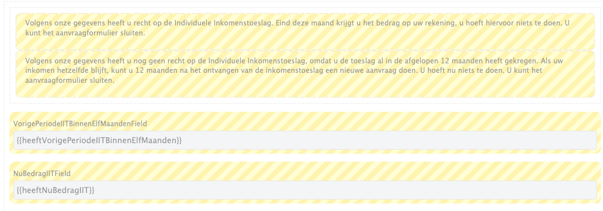

# Open Forms configuratie voor IIT Prefill endpoint (fetch service)

Binnen open forms is een fetch service ingericht die een direct verzoek doet naar mule (esb). 

- Service naam: AviPrefill of AviPrefillAccp
- Service Fetch naam: AviPrefill of AviPrefillAccp

Mule maakt vervolgens een verzoek naar een view 'MW_IIT'. Deze view retourneert momenteel de volgende waardes:

```
{
  "ParticipatieWetKlant": true,
  "NuBedragIIT": false,
  "VorigePeriodeIIT": 202507,
  "VorigePeriodeIITBinnenElfMaanden": true
}
```

Certificaten zijn direct ingeladen binnen Open Forms. Deze zijn te vinden onder de naam AviPrefillCert.

## Wijzigingen in formulier

### Status melding AVI
Voor AVI moet er gecontroleerd worden of de burger:

1. Binnenkort al avi krijgt
2. Nog geen recht heeft op IIT want dit is de afgelopen 11 maanden al uitgekeerd

Deze twee controles worden uitgevoerd door de eerdergenoemde view en vervolgens als melding getoond afhankelijk van de uitkomst.

In het formulier zijn velden toegevoegd om deze melding wel of niet te tonen.

