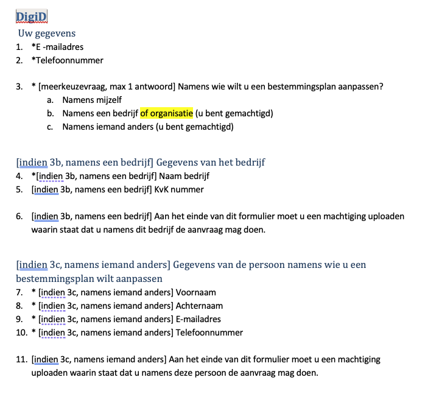
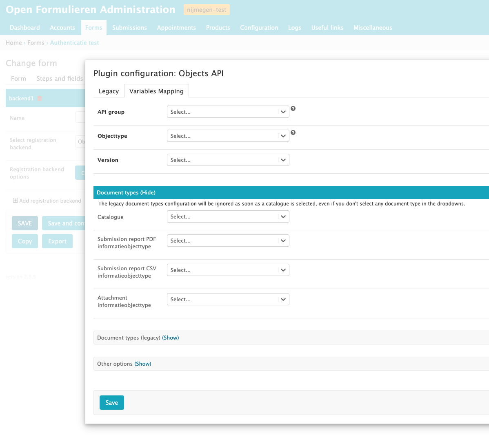

# Migratie


## Migratie tool
De migratie tool kan je [hier vinden](https://github.com/GemeenteNijmegen/formio-converter).
De tool bespaart heel veel handmatig klikwerk door alle velden automatisch over te nemen en de juiste naam en titel te geven.

**Beperkingen**
- De logica kan niet worden overgenomen en moet handmatig opnieuw worden toegevoegd
- https://github.com/GemeenteNijmegen/formio-converter/issues/2
- Subformulieren worden gedupliceerd en zijn dus niet meer herbruikbaar in open-formulieren
- Er moet handmatig getest worden of de velden goed zijn overgekomen.


## Migratie process

### Stap 1. draaien conversie tool
Dit is een stap die we waarschijnlijk in bulk kunnen doen en zo alle formulieren in een keer importeren/klaar zetten om geimporteerd te worden.

### Stap 2. Inrichten logica
De logica van een formulier houd een aantal dingen in:
- Welke velden/paginas wanneer getoond moeten worden (bijv. velden voor contactgegevens wanneer een gebruiker kiest "ik vul deze aanvraag voor iemand anders in").
- Berekeningen van prijzen op basis van antwoorden in formulieren
- Welke velden in het formulier vooringevuld moeten worden op basis van KVK/BPR data.

Wellicht kan bij deze stap ook het inrichten van waar het formulier moet landen megenomen worden (o.b.v. een configuratie voorbeeld). 

Dit kan werken omdat we  een aantal inputs hebben van de bestaande/gewenste logica. Hoe dit eruit ziet wordt verderop uitgeleged.

### Stap 3. Peer review
Wanneer de groep van mensen die stap 2 uitvoert groter is dan 1 kunnen we peer reviews doen. Iemand voegt de logica toe, iemand anders uit de groep voert een review uit.

### Stap 4. Vragen of afdeling wil testen
Wanneer het formulier goed is, kan de afdeling gaan testen.
Let op: hierbij dus zorgen dat het functioneel hetzelfde blijft.

### Stap 5. Live zetten formulier
Zodra de afdeling akoord is kan het formulier live worden gezet. Dit betekent: 
- Kopieren formulier van acceptatie naar productie omgeving (incl, voorinvulling).
- Registratie configuratie voor productie inrichten
- Aanpassen links op nijmegen.nl (of andere locaties) naar de nieuwe url.


## Logica inrichten
Om wat meer inzicht te bieden in wat het inhoud om het formulier openieuw van logica te voorzien hier wat uitleg over wat de input is en hoe configuratie in zijn werk gaat.

Inputs:
- Templates van formulieren (ontwerpen zijn bijgehouden als het goed is bij elke wijziging)
- Export van logica regels uit de oude formulieren (bij product van conversie tool)

Vervolgens zijn er een aantal dingen om rekening me te houden bij het configureren:
- Dynamische formulieren (logica regels)
- Opzetten registratie

Op elk item wordt hieronder los ingegaan.
Daarnaast is er documentatie te vinden over hoe de formulier configuratie werkt: https://open-forms.readthedocs.io/en/stable/manual/forms/index.html

### Templates van formulieren
We hebben van alle formulieren templates waarin beschreven staat welke logica er in elk formulier zit. Deze kunnen als input gebruikt worden in het ombouwen van de formulieren. Zie het screenshot hieronder.


### Input van oude formulieren
Een bijproduct van de conversie tool is een overzicht van de logica. Hieronder is een voorbeeld opgenomen hoe dat er uit ziet:
```json
page3 has conditional: {"show":true,"conjunction":"all","conditions":[{"component":"ikMeldAan","operator":"isEqual","value":"b"}]}
geboortedatum has conditional: {"show":true,"when":"ikMeldAan","eq":"a"}
inWelkStadsdeelWiltUMeedoenAanSportactiviteitenBekijkDeStadsdelen has conditional: {"show":true,"conjunction":"all","conditions":[{"component":"ikMeldAan","operator":"isEqual","value":"a"}]}
aanmeldenVoorSportactiviteitA as custom conditional: "show = false;\n\nif (data.stadsdeelVolwassen && data.stadsdeelVolwassen.stadsdeel == 'Nijmegen-Noord') {\n  show = true;\n}"
aanmeldenVoorSportactiviteitB as custom conditional: "show = false;\n\nif (data.stadsdeelVolwassen && data.stadsdeelVolwassen"
naamAmbulantBegeleider as custom conditional: "show = false;\n\nvar a = data.aanmeldenVoorSportactiviteitA && data.aanmeldenVoorSportactiviteitA.a ? true:false;\nvar b = data.aanmeldenVoorSportactiviteitB && data.aanmeldenVoorSportactiviteitB.a ? true:false;\nvar c = data.aanmeldenVoorSportactiviteitC && data.aanmeldenVoorSportactiviteitC.a ? true:false;\nvar e = data.aanmeldenVoorSportactiviteitE && data.aanmeldenVoorSportactiviteitE.a ? true:false;\nvar f = data.aanmeldenVoorSportactiviteitF && data.aanmeldenVoorSportactiviteitF.a ? true:false;\nvar g = data.aanmeldenVoorSportactiviteitG && data.aanmeldenVoorSportactiviteitG.a ? true:false;\n\nif (a || b || c || e || f || g) {\n  show = true;\n}"
sportUwKindBijEenSporvereniging has conditional: {"show":true,"conjunction":"all","conditions":[{"component":"ikMeldAan","operator":"isEqual","value":"b"}]}
```

### Dynamische formulieren (logica regels)
Er is hier uitleg te vinden over dynamische formulieren (e.g. configureren van de logica regels): https://open-forms.readthedocs.io/en/stable/manual/forms/logic.html

### Opzetten registratie
Het opzetten van de registratie kan ook een onderdeel van stap 2 in het process zijn. Hierin moet geconfigureerd worden hoe een formulier door wordt gestuurd na het invullen. Als we hiervoor een heldere configuratie bieden moet iedereen dit kunnen configurereren.
Zie het screenshot hieronder voor een voorbeeld van hoe een registratie configuratie eruit ziet:
