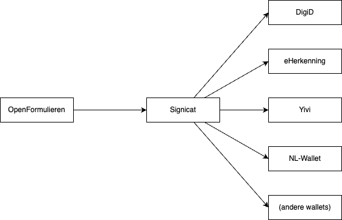

# Technische documentatie OpenIDConnect - Yivi

In Nijmegen bieden wij, naast inloggen met DigiD en eHerkenning, [Yivi als alternatief inlogmiddel](https://www.yivi.app/). Yivi is een [ID-Wallet](https://www.digitaleoverheid.nl/overzicht-van-alle-onderwerpen/identiteit/id-wallet/), dit is momenteel de enige wallet die ondersteund wordt in Nijmegen, maar volgens de nieuw eIDAS-verordening moeten we binnekort alle door de overheid erkende wallets ondersteunen. Om de complexiteit maken we gebruik van Signicat als een broker. Signicat praat standaard OIDC om integratie met zowel DigiD, eHerkenning als ID-Wallets te voorzien.




## DigiD via OIDC
Hieronder wordt de OIDC flow voor authenticatie met DigiD bij mijn-nijmegen beschreven. Dit om een idee te geven hoe een flow voor een klassiek authenticatie middel (lees niet ID-Wallet) eruit ziet bij Signicat. Hier is dus eigenlijk niets speciaals aan en puur OIDC. 

### Authorization endpoint
**Request**
```
https://<signicat>/oidc/authenticate
    ?scope=openid idp_scoping:digid
    &response_type=code
    &redirect_uri=https://mijn.accp.nijmegen.nl/auth
    &state=<random value>
    &client_id=...
```

**Response**
The user is redirected to
```
https://mijn.accp.nijmegen.nl/auth
    ?code=...
    &state=...
```

### Token endpoint
**Request**
De applicatie vraagt het token aan het token endpoint (standaard OIDC)
```
https://<signicat>/oidc/token
    ?code=<code received from authorization endpoint>
    &grant_type=authorization_code
    &redirect_uri=https://mijn.accp.nijmegen.nl/auth
```

**Response**
Een standaard OIDC token response.
```
{
  "access_token" : "...",
  "refresh_token" : "...",
  "scope" : "openid idp_scoping:digid",
  "id_token" : "eyJraWQ....x8tg1A",
  "token_type" : "Bearer",
  "expires_in" : 1800
}
```

**JWT ID-Token inhoud**
De payload van het JWT token uit het request hierboven ziet er zo uit. Het BSN van de gebruiker zit hier in de sub claim.
```
{
  "sub": "900026236",
  "aud": "...client id...",
  "acr": "urn:oasis:names:tc:SAML:2.0:ac:classes:MobileTwoFactorContract",
  "iss": "https://<signicat>/oidc",
  "subject_issuer": "DigiD",
  "exp": 1740475123,
  "iat": 1740473323
}
```


## Yivi via OIDC
Yivi (of andere ID-Wallets) werken met attributen die uitgevraagd kunnen worden.
Een aantal voorbeelden van attributen zijn:
- Je BSN
- Een KVK nummer
- Je email address
- Je telefoonummer
- Je adres
- Je voornamen

Die attributen kunnen in verschillende samenstellingen worden uitgevraagd. Zo kunnen we een BSN vragen voor een publiekrechtelijk formuilier en een email address voor een privaatrechtelijk formulier (waar we geen BSN mogen gebruiken).

We kunnen zelfs door middel van 'conditional disclosure' mensen zelf laten besluiten welke gegevens ze delen. Bijvoorbeeld OF een BSN OF en KVK nummer (een van de 2) om zo met een Yivi login knop zowel een alternatief voor DigiD als eHerkenning te bieden. Dit kan je zelf proberen op onze [mijn-nijmegen acceptatie omgeving](https://mijn.accp.nijmegen.nl), kies voor inloggen met Yivi.

Hieronder wordt de OIDC flow voor authenticatie met Yivi bij mijn-nijmegen beschreven. Dit is net zoals DigiD hierboven standaard OIDC.

### Authorization endpoint
**Request**
```
https://<signicat>/oidc/authenticate
    ?scope=openid idp_scoping:yivi irma-demo.gemeente.personalData.bsn
    &response_type=code
    &redirect_uri=https://mijn.accp.nijmegen.nl/auth
    &state=<random value>
    &client_id=...
```
Uitleg: We geven hier de OIDC scope `irma-demo.gemeente.personalData.bsn` mee om een BSN uit te vragen. Deze scope is de naam van het attribuut in de Yivi wallet. Welke attributen er beschikbaar zijn is te vinden op [deze pagina](https://privacybydesign.foundation/attribute-index/nl/irma-demo.gemeente.personalData.html) (de link gaat naar de demo attributen van persoongegevens). Naast BSN zouden we ook een KVK nummer kunnen uitvragen door de scope te veranderen naar `irma-demo.signicat.authorization.kvkNumber`. Of zowel BSN als email address: `irma-demo.gemeente.personalData.bsn pbdf.sidn-pbdf.email`. Welke attributen hier uitgevraagd worden heeft invloed op de inhoud van het JWT token.

**Response**
The user is redirected to (identiek aan DigiD hierboven)
```
https://mijn.accp.nijmegen.nl/auth
    ?code=...
    &state=...
```

### Token endpoint
**Request**
De applicatie vraagt het token aan het token endpoint (identiek aan DigiD hierboven, en standaard OIDC)
``` 
https://<signicat>/oidc/token
    ?code=<code received from authorization endpoint>
    &grant_type=authorization_code
    &redirect_uri=https://mijn.accp.nijmegen.nl/auth
```

**Response**
Een standaard OIDC token response.
```
{
  "access_token" : "...",
  "refresh_token" : "...",
  "scope" : "openid idp_scoping:digid",
  "id_token" : "eyJraWQ....x8tg1A",
  "token_type" : "Bearer",
  "expires_in" : 1800
}
```

**JWT ID-Token inhoud**
De payload van het JWT token uit het request hierboven kan er verschillend uit zien afhankelijk van de uitgevraagde scopes in het authorization requrest. De uitgevraagde attributen worden terugegeven in losse claims van het JWT. Daarom hier een aantal versies.

Met de scope voor het attribuut: `irma-demo.gemeente.personalData.bsn`
```
{
  "sub": "weogjwoeigjeo320fjowej", // Random string
  "irma-demo.gemeente.personalData.bsn": "900026236"
  "aud": "...client id...",
  "iss": "https://<signicat>/oidc",
  "subject_issuer": "Yivi",
  "exp": 1740475123,
  "iat": 1740473323
}
```

Met de scope voor het attribuut: `irma-demo.signicat.authorization.kvkNumber`
```
{
  "sub": "weogjwoeigjeo320fjowej", // Random string
  "irma-demo.signicat.authorization.kvkNumber": "69599084"
  "aud": "...client id...",
  "iss": "https://<signicat>/oidc",
  "subject_issuer": "Yivi",
  "exp": 1740475123,
  "iat": 1740473323
}
```

Met de scope bij het uitvragen van twee attributen: `irma-demo.gemeente.personalData.bsn pbdf.sidn-pbdf.email`
```
{
  "sub": "weogjwoeigjeo320fjowej", // Random string
  "irma-demo.gemeente.personalData.bsn": "900026236"
  "pbdf.sidn-pbdf.email": "test@example.com"
  "aud": "...client id...",
  "iss": "https://<signicat>/oidc",
  "subject_issuer": "Yivi",
  "exp": 1740475123,
  "iat": 1740473323
}
```