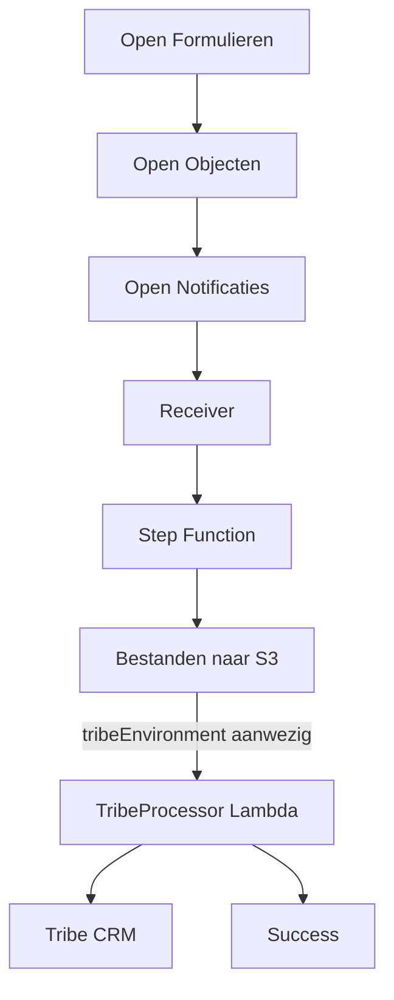

# Tribe-koppeling

Formulierinzendingen uit Open Formulieren kunnen naar het CRM-systeem Tribe worden
gestuurd. De eerste koppeling is Autodelen; de opzet is gemaakt om later een volgende
Tribe-omgeving (bijvoorbeeld Energieloket) toe te voegen zonder de bestaande keten
opnieuw te ontwerpen.

## Hoe een inzending bij Tribe terechtkomt



Een formulier wordt in Open Formulieren gekoppeld aan het objecttype `TribeVerzoek`.
De receiver herkent dit objecttype net als elk ander (submission, ESF-taak, etc.) en
zet de inzending op de bestaande Step Function. Zodra de Step Function ziet dat
`tribeEnvironment` aanwezig is, wordt de `TribeProcessor`-Lambda aangeroepen; die mapt
de gegevens naar het Tribe-formulier en post ze naar Tribe.

## Het objecttype als contract

`TribeVerzoek` is generiek voor alle Tribe-koppelingen. Twee velden bepalen de routing:

- `tribeEnvironment` — de logische Tribe-omgeving, bijvoorbeeld `AUTODELEN`.
- `tribeSubmissionType` — het type aanmelding binnen die omgeving, bijvoorbeeld
  `AUTODELEN_AANMELDING`.

De formulier-specifieke velden staan in een eigen deelobject, bijvoorbeeld `autodelen`.
Het schema staat in `src/submission-forwarder/schema/TribeVerzoek.json`, naast de
andere objecttypeschema's van deze repo. Het bijbehorende runtime-schema (Zod) staat in
`src/submission-forwarder/shared/TribeVerzoek.ts`.

Interne Open Forms-veldnamen komen alleen voor in de Open Forms-beheerinterface, waar
een formulierbouwer ze aan de objecttypevelden koppelt. In de AWS-code wordt uitsluitend
met de objecttypevelden gewerkt.

## Waar de code staat

```
src/submission-forwarder/tribe/
├── client/          TribeClient-interface, HTTP-implementatie, clientfactory
├── constants/       Tribe-property- en record-ID's achter functionele namen
├── errors/          MappingError, ConfigurationError, TribeAuthenticationError, TribeRequestError
├── mappers/         Zuivere mapping van objecttypevelden naar de Tribe-payload
├── processors/      Eén processor per submissiontype + de registry die ze selecteert
├── support/         Gedeelde types (processorcontract, context, resultaat)
├── Handler.ts        Selecteert omgeving/processor, bouwt de client, logt context
└── TribeProcessor.lambda.ts   Lambda-entrypoint
```

Een client is altijd gebonden aan precies één Tribe-omgeving en wordt per verwerking
opnieuw aangemaakt — er wordt geen token of secret hergebruikt tussen inzendingen.

Elk submissiontype (nu alleen Autodelen) heeft een eigen processor die verantwoordelijk
is voor de volgorde van de Tribe-aanroepen. Voor Autodelen is dat: mappen, authenticeren,
POST. Een processor mag meerdere aanroepen na elkaar doen en een eerdere response
gebruiken om een volgende payload te bouwen; dat is nog niet nodig voor Autodelen.

## Dry-run

Op acceptatie staat de omgevingsvariabele `TRIBE_SEND_MODE` op `DRY_RUN`; op productie
is die leeg. Bij dry-run authenticeert de processor gewoon, maar slaat de POST naar
Tribe over. De gemapte payload wordt dan alleen op `DEBUG`-niveau gelogd, dus in de
praktijk alleen zichtbaar op acceptatie.

## Een inzending volgen

Elke stap logt gestructureerd. Zoek in CloudWatch Logs Insights op de referentie:

```
fields @timestamp, @message, reference, tribeEnvironment, tribeSubmissionType, clientIdSuffix, trace, traceMessage
| filter reference = "OF-..."
| sort @timestamp asc
```

`clientIdSuffix` toont alleen de laatste vier tekens van de gebruikte client-ID, zodat je
kunt controleren welke Tribe-credentials zijn gebruikt zonder dat de volledige client-ID,
het secret of het token ooit in een logregel staan.

## Foutafhandeling

| Fout | Betekenis | Opnieuw proberen zinvol? |
|---|---|---|
| `TribeAuthenticationError` / `TribeRequestError` met `retryable: true` | Netwerkfout, timeout, Tribe 5xx | Ja |
| `TribeRequestError` met `retryable: false` | Tribe wees de aanvraag af (4xx) | Nee |
| `MappingError` | Een waarde heeft geen bekende Tribe-tegenhanger | Nee, eerst de mapping oplossen |
| `ConfigurationError` | Onbekende omgeving/combinatie, of secret nog niet ingevuld | Nee, eerst configuratie herstellen |

## Een nieuw submissiontype toevoegen

1. Nieuw deelobject in `TribeVerzoek.json` (naast `autodelen`).
2. Nieuw bestand in `constants/` met de Tribe-ID's van het nieuwe formulier.
3. Nieuwe mapperfunctie in `mappers/`, herbruik `mapChoiceField()` voor keuzevelden.
4. Nieuwe processor in `processors/`, zelfde vorm als `autodelen-aanmelding.ts`.
5. Registreren in `TribeProcessor.lambda.ts`.
6. Nieuwe Tribe-omgeving? Voeg een secret toe in `tribe/TribeCredentials.ts`, een
   `TRIBE_<OMGEVING>_SECRET_ARN`-omgevingsvariabele in `SubmissionForwarder.ts` en
   `TribeProcessor.lambda.ts`, en een entry in `environmentSecretArns`. Binnen een
   bestaande omgeving is dit niet nodig.

## Bekende openstaande punten

Het `contactMetAnderen`-veld van Autodelen wordt technisch gewoon gemapt (ja/nee/
neeBekenden → hun Tribe-ID), maar de toestemmingstekst die Tribe bij "ja" toont, is nog
niet afgestemd met de tekst die het formulier belooft. Dat is een functionele/juridische
vraag die los van de code met Team Online moet worden uitgezocht.
