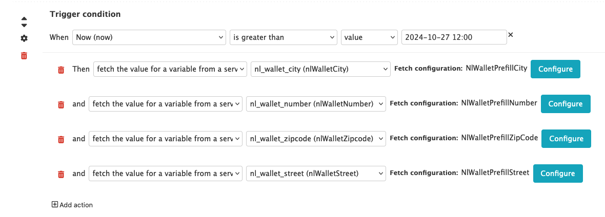

# NL Wallet beproeving
Om de NL Wallet (omsloten via Signicat en VerID) te beproeven maken we gebruik van open forms (SaaS) met wat extra lambdas/maatwerk (deze directory van de repo).

## Wat hebben we nodig voor de beproeving
Voor de beproeving testen we twee dingen met VerID en Signicat.
1. Inloggen op Mijn-nijmegen
2. Een privaatrechtelijk formulier met OpenForms

### Inloggen op Mijn Nijmegen
Feature flags:
- In login & auth lambda
- Flag is set in configuration of project
- Env variable is set in USE_NL_WALLET_VERID and USE_NL_WALLET_SIGNICAT

Login opties tonen:
- Dev: https://mijn.dev.nijmegen.nl/login?nlwallet=true
- Accp: https://mijn.accp.nijmegen.nl/login?nlwallet=true
- Prod: https://mijn.nijmegen.nl/login?nlwallet=true

### Formulier in OpenForms
Feature flag:
- Configuratie is als het goed is afgerond (zowel aan Signicat als aan VerID kant als aan OpenFormulieren kant)
- Formulier op active zetten (in openforms console) zorgt er voor dat het productie formulier bereikt kan worden.

Formulier urls:
- Acceptance:
  - VerID: https://nijmegen.test.open-formulieren.nl/boomspiegel-verid
  - Signicat: https://nijmegen.test.open-formulieren.nl/boomspiegel
- Production:
  - VerID: https://nijmegen.open-formulieren.nl/boomspiegel-verid
  - Signicat: https://nijmegen.open-formulieren.nl/boomspiegel


## OpenIDConnect koppelingen
Omdat open-formulieren niet direct OIDC koppelingen ondersteund wordt voor de beproeving de installatie misbruikt. 
De inrichting is als voligt:
- De DigiD (OIDC) pluging wordt gebruikt voor een OIDC koppeling naar Signicat met publiekrechtelijk (bsn dus) doel.
- De DigiD Machtigen (OIDC) pluging wordt gebruikt voor een OIDC koppeling naar Signicat met privaatrechtelijk (geen bsn dus) doel.

Omdat het BSN dat open-forms kent (dit is het attribuut `{{auth_bsn}}`) alleen uit het JWT token gehaald kan worden, is er een token caching service ingericht om de prefill voor elkaar te krijgen. Zie hieronder.


**Tl;dr** Open forms haalt het jwt token op via de chacing service en gebruikt de service om prefill van velden uit het token te doen. De key die hiervoor wordt gebruikt is de subject claim in het BSN.

| OIDC Koppeling        | Gebruikt voor   | Configuratie                                           | Formulier                                                        |
| --------------------- | --------------- | ------------------------------------------------------ | ---------------------------------------------------------------- |
| DigiD                 | BSN (Signicat)  | [Configuratie](./img/oidc-configs/digid.png)           | [hier](https://alb.sandbox-01.csp-nijmegen.nl/boomspiegel)       |
| DigiD Machtigen       | Privaat (VerID) | [Configuratie](./img/oidc-configs/digid-machtigen.png) | [hier](https://alb.sandbox-01.csp-nijmegen.nl/boomspiegel-verid) |
| Eherkenning           | Niet gebruikt   | n/a                                                    |                                                                  |
| EHerkenning machtigen | Niet gebruikt   | n/a                                                    |                                                                  |


**Dit is niet meer relevant voor de beproeving:**
~~VerID connectie met BSN is niet mogelijk omdat de `nin` claim (waar het BSN in moet zitten volgens OIDC) bestaat uit een object. Dit object kunnen we in OpenForms niet benaderen. Bijvoorbeeld~~
```json
{
  "nin": {
    "identifier": "999999333",
    "type": "NL_BSN",
  }
}
```


## Confiugratie aan open formulieren kant
### Deel 1: De OIDC configuratie
- De OIDC configuratie vind je in de tabel bovenaan deze pagina

### Deel 2: De gegevens gebruiken in een formulier
**Publiekrechtelijk**: We hebben een BSN, deze zit in de `{{auth_bsn}}` variabele. De BRP haal centraal prefill plugin kan gebruikt worden om BRP prefill te doen.

**Privaatrechtelijk**: 
- Maak een nieuwe service aan en voeg het domein en de API key toe, zie screenshot hieronder


- In het formulier kan je dan de velden prefillen door een logica regel toe te voegen



## Implementatie token caching service


## Thema
Er is een CSS file geconfigureerd met het theme deze is [hier te vinden](https://github.com/GemeenteNijmegen/openforms-test-temp/tree/acceptance/nl-wallet-theme).
Het thema kan aangemaakt worden in de beheer interface van OF. 
- Upload de CSS file en het logo. 
- Selecteer dan in de formulier configuratie het aangemaakte thema.
- Done, het formulier en de inlog methoden zeggen nu 'Inloggen met uw ID Wallet'