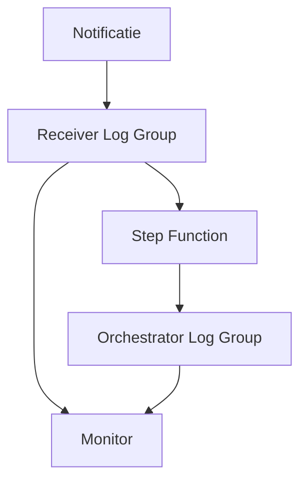
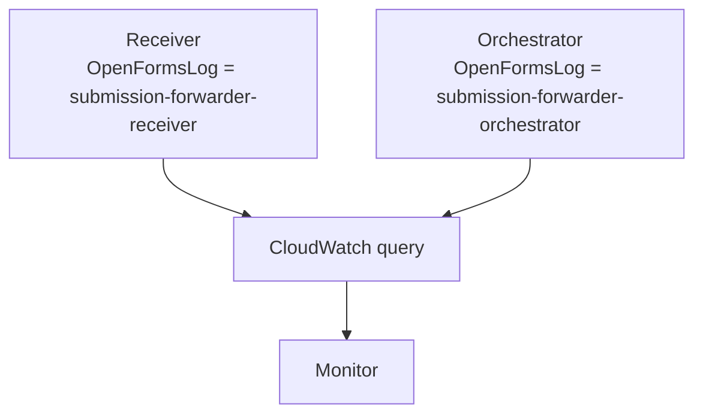
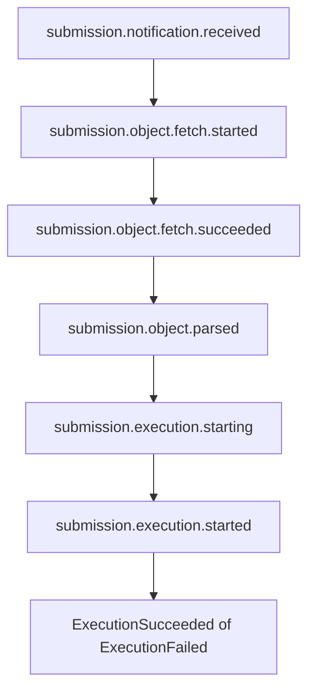
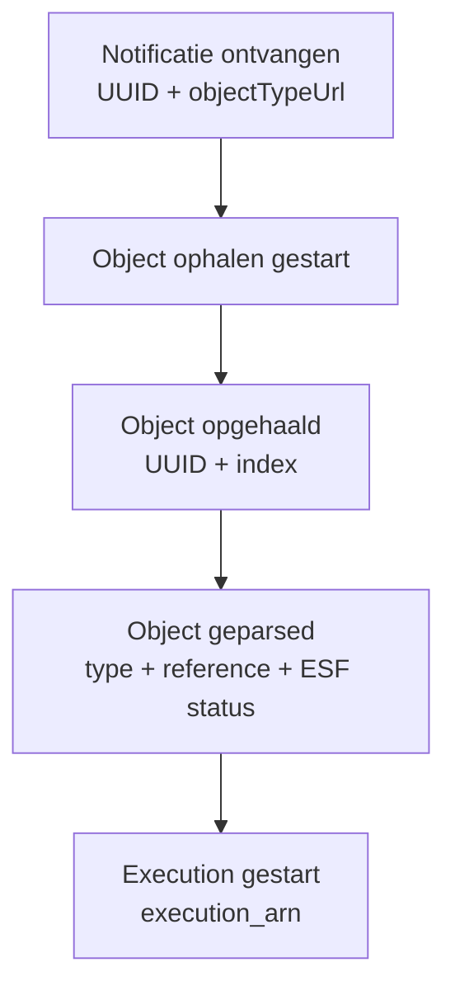
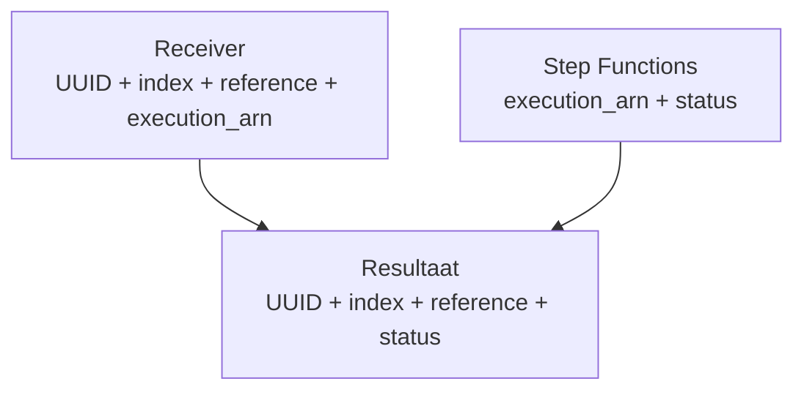

# Submission logging

Hier staan de loggingafspraken die de submission-forwarder en de submission-processing-monitor samen gebruiken.

Het gaat vooral om twee vragen:

1. waar moeten we zoeken?
2. welke events en velden kunnen we vertrouwen?

De bestaande Powertools logging blijft gewoon bestaan.

## De twee belangrijke Log Groups

Voor de dagelijkse controle zijn vooral de receiver en de Step Function nodig.



De receiver laat zien wat er gebeurt voordat een Step Function gestart is.

De orchestrator laat zien wat er daarna met de execution gebeurt.

De losse Lambda Log Groups blijven bestaan voor verder onderzoek als ergens iets misgaat.

## Log Groups vinden

De fysieke Log Group namen worden door CDK gegenereerd. De monitor hoeft die namen niet te kennen.
We kunnen tags gebruiken die prima werken met de API en CLI.

De actieve receiver krijgt:

```
OpenFormsLog=submission-forwarder-receiver
```

De actieve orchestrator krijgt:

```
OpenFormsLog=submission-forwarder-orchestrator
```

De key en values staan in SubmissionLogging.ts.

Oude retained Log Groups hebben deze tag niet en worden daardoor niet meegenomen door de monitor.



## Queryen vanuit de monitor

CloudWatch Logs Insights kan via de API Log Groups op tags selecteren. Bijvoorbeeld:

Receiver:

```
SOURCE logGroupTags([{"key":"OpenFormsLog","values":["submission-forwarder-receiver"]}])
| fields @timestamp, event, objectUuid, objectIndex, reference
| sort @timestamp asc
```

Orchestrator:

```
SOURCE logGroupTags([{"key":"OpenFormsLog","values":["submission-forwarder-orchestrator"]}])
| filter type in ["ExecutionSucceeded", "ExecutionFailed", "ExecutionTimedOut", "ExecutionAborted"]
| fields @timestamp, type, execution_arn
| sort @timestamp asc
```

`SOURCE` werkt via de CloudWatch Logs API en CLI.

Tags werken zover bekend NIET in de console. In de CloudWatch Logs Insights-console selecteer je de Log Group zelf.

## Vaste events

Nieuwe monitoringlogs gebruiken waarden uit SubmissionLogEvent.

De normale route wordt:



Er zijn ook vaste events voor andere uitkomsten:

```
submission.notification.parse.failed
submission.object.fetch.failed
submission.object.parse.failed
submission.object.ignored
submission.execution.start.failed
```

Gebruik de constants uit deze shared map. Maak niet op andere plekken bijna dezelfde eventnamen.

## Vaste velden

Gebruik waar de informatie beschikbaar is dezelfde veldnamen:

```
event
objectUuid
objectIndex
objectType
objectTypeUrl
reference
formName
esfStatus
execution_arn
reason
resourceUrl
correlationId
```

objectUuid en objectIndex samen wijzen naar één specifieke versie van een Object.

objectType is het type waarmee de applicatie werkt, bijvoorbeeld `submission` of `esfTaak`.

objectTypeUrl is de technische Objecttypes URL.

Voor het execution ARN gebruiken we bewust execution_arn. Step Functions gebruikt die veldnaam zelf ook.

## Log zodra de informatie bekend is

Wacht niet met loggen op een volgende externe call als de context al bekend is.



Als de Objects API-call bijvoorbeeld blijft hangen, kunnen we dan nog steeds zien dat de notificatie binnenkwam en dat het ophalen gestart is.

## Receiver en Step Functions koppelen

Bij een succesvolle execution-start gaat de receiver uiteindelijk minimaal loggen:

```
objectUuid
objectIndex
objectType
reference
execution_arn
```

De native Step Functions logs bevatten daarna onder andere:

```
execution_arn
ExecutionSucceeded
ExecutionFailed
ExecutionTimedOut
ExecutionAborted
```

Die kunnen we op `execution_arn` bij elkaar brengen.



Het resultaat kan dan bijvoorbeeld worden:

```
objectUuid   objectIndex   reference   status
abc...       7             OF-12345    ExecutionSucceeded
def...       3             OF-12346    ExecutionFailed
```

## Bestaande logging blijft bestaan

De nieuwe monitoringevents komen naast de bestaande logging.

Deze wijziging is niet bedoeld om bestaande troubleshooting te veranderen.

Voor deze loggingverbetering blijven daarom onder andere bestaan:

- bestaande DEBUG dumps;
- bestaande menselijke logteksten;
- bestaande execution names;
- bestaande Step Function input;
- bestaande error handling;
- bestaande trace-opslag.

Nieuwe INFO-events bevatten alleen de informatie die nodig is om de verwerking terug te vinden. Geen volledige formulierinhoud.

## Native Step Functions events

Deze AWS-events staan ook centraal in SubmissionExecutionEvent:

```
ExecutionStarted
ExecutionSucceeded
ExecutionFailed
ExecutionTimedOut
ExecutionAborted
```

De monitor gebruikt deze samen met execution_arn om de receiverlogging aan het uiteindelijke executionresultaat te koppelen.
