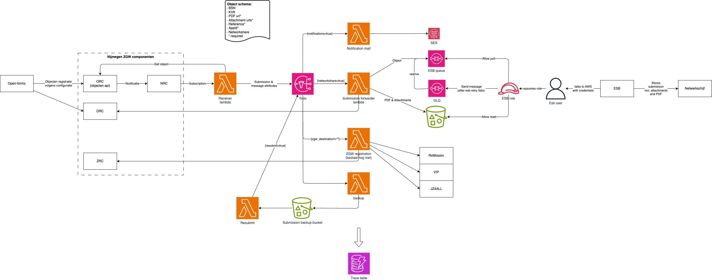

# Submission forwarder

Korte samenvatting van deze integratie die de objecten api aan onze ESB knoopt.

Zie ook: 
- [beheer tips en tricks](../../../docs/BeheerTipsAndTricks.md)

## Implementatie

### Details ESB integratie
De ESB heeft een interne retry en kan berichten op de AWS DLQ zetten wanneer afhandeling aan de ESB kant niet lukt. Wij kunnen een redrive doen om berichten opnieuw bij de ESB in te dienen.

### Details voor formulier beheerders
- In OpenFormulieren blijven inzendingen (als ze zijn doorgestuurd) nog 7 dagen staan. Als het doorsturen naar een registratie systeem faalt blijven formulieren 30 dagen staan.
- Er is een interne backup ingebouwd (net als bij de oude webformulieren). De resubmit lambda bestaat nog niet. Hier blijven inzendingen 90 dagen bewaard. Dit is alleen het AWS SQS bericht, de documenten blijven in de documenten API.

## Objecttype
Het schema dat we gebruiken voor het objecttype kan je [hier vinden](../schema/netwerkschijfESBFormulierInzending.json).