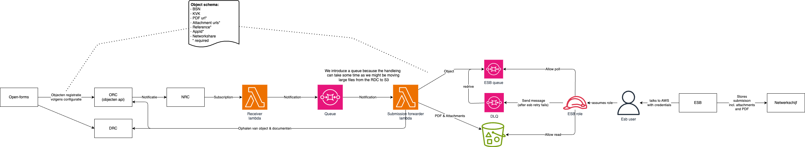

# Submission forwarder

Korte samenvatting van deze integratie die de objecten api aan onze ESB knoopt.

Zie ook: 
- [beheer tips en tricks](../../../docs/BeheerTipsAndTricks.md)

## Implementatie


### Details ESB integratie
TODO

### Details voor formulier bouwers
- TODO inrichting documenteren

### Details voor formulier beheerders
- TODO resubmit binnen 7 dagen, wat anders?


## Testen
TODO Hoe kunnen we testen?


## Objecttype
We hanteren momenteel het volgende schema voor een object dat richting de ESB gaat.
```json
{
  "type": "object",
  "$schema": "http://json-schema.org/draft/2020-12/schema",
  "required": [
    "reference",
    "pdf",
    "attachments",
    "type",
    "AppId"
  ],
  "properties": {
    "bsn": {
      "type": "string"
    },
    "kvk": {
      "type": "string"
    },
    "pdf": {
      "type": "string"
    },
    "type": {
      "type": "string"
    },
    "AppId": {
      "type": "string"
    },
    "reference": {
      "type": "string"
    },
    "attachments": {
      "type": "array",
      "items": {
        "type": "string"
      }
    },
    "netwerkshare": {
      "type": "string"
    }
  }
}
```

Een object ziet er dan zo uit:
```json
{
  "bsn": "999992818",
  "kvk": "",
  "pdf": "https://mijn-services.accp.nijmegen.nl/open-zaak/documenten/api/v1/enkelvoudiginformatieobjecten/278b886a-cb2b-43ac-a585-bd51f799356a",
  "type": "ESB route test formulier",
  "AppId": "TDL",
  "reference": "OF-ENUU6S",
  "attachments": [],
  "networkshare": "//karelstad/data/gemeenschappelijk/Webformulieren/Accp/TDL"
}
```