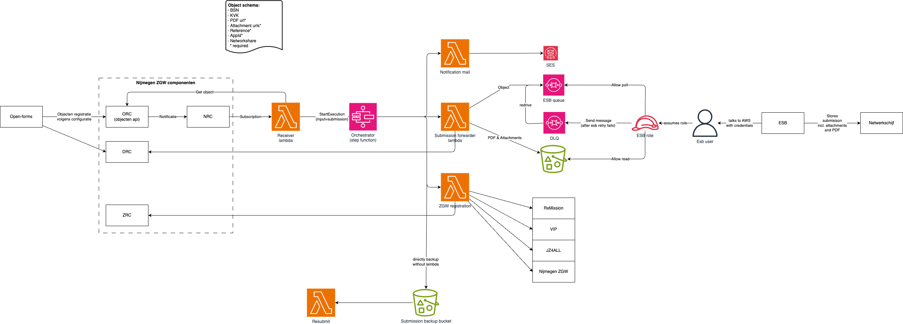

# Submission forwarder

Korte samenvatting van deze integratie die de objecten api aan onze ESB knoopt.

Zie ook: 
- [beheer tips en tricks](../../../docs/BeheerTipsAndTricks.md)

## Implementatie

### Details ESB integratie
De ESB heeft een interne retry en kan berichten op de AWS DLQ zetten wanneer afhandeling aan de ESB kant niet lukt. Wij kunnen een redrive doen om berichten opnieuw bij de ESB in te dienen.

### Details voor formulier beheerders
- In OpenFormulieren blijven inzendingen (als ze zijn doorgestuurd) nog 7 dagen staan. Als het doorsturen naar een registratie systeem faalt blijven formulieren 30 dagen staan.
- Er is een interne backup ingebouwd (net als bij de oude webformulieren). De resubmit lambda bestaat nog niet. Hier blijven inzendingen 90 dagen bewaard. Dit is alleen het AWS SQS bericht, de documenten blijven in de documenten API.

## Objecttypes
Het schema dat we gebruiken voor het submission objecttype kan je [hier vinden](../schema/netwerkschijfESBFormulierInzending.json).

Er is support voor meerdere objecttypes:

For the ability to send on multiple object types to the step function,
we need to support more than the submission object.

The step function will receive an object with at least pdf, attachments and 
reference keys.

For determining object type, an SSM parameter is available: This contains
the supported object types, in a format like this:

`<objectType>##<objectTypeUrl>;<objectType>##<objectTypeUrl>`

This only supports for <objectType> values from 
`ObjectParser.supportedObjectTypes`. All unsupported objects are 
ignored.

## Submission trace
Er is een tabel (dynamodb) waarin alle lambda's een trace record wegschrijven als ze een verwerking hebben gedaan van een submission. De key is dan het submission ID en het handler ID (bijv. `receiver` of `esb_forwarder`). De sortkey is een timestamp. 

Idee is dat we hier later wat automatische logging / monitoring op kunnen inrichten (e.g. registraties die fout zijn gegaan volgen).
