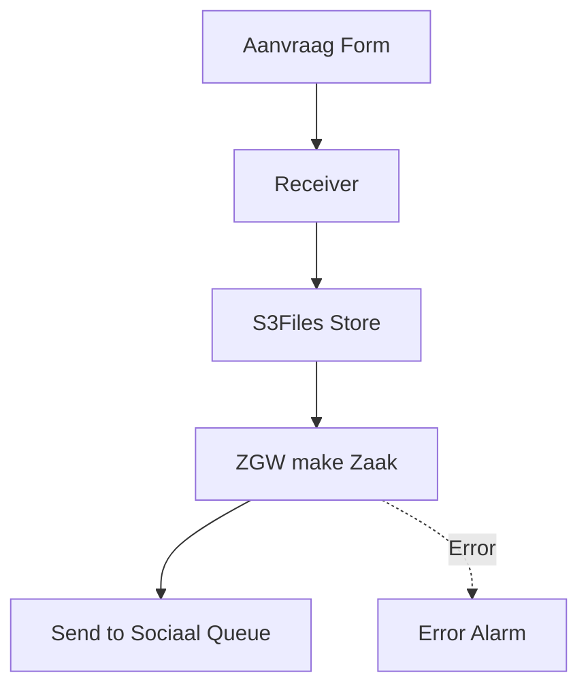

# Aanvragen Sociaal Domein

Aanvragen Sociaal domein worden in hetzelfde aws account afgehandeld, maar in een andere repo. Een queue zit hiertussen
De connectie wordt gelegd met een een queue die alleen intern in het account gebruikt wordt.

