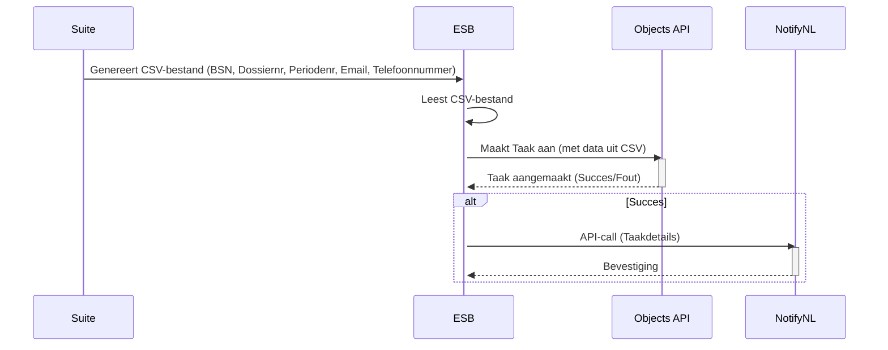
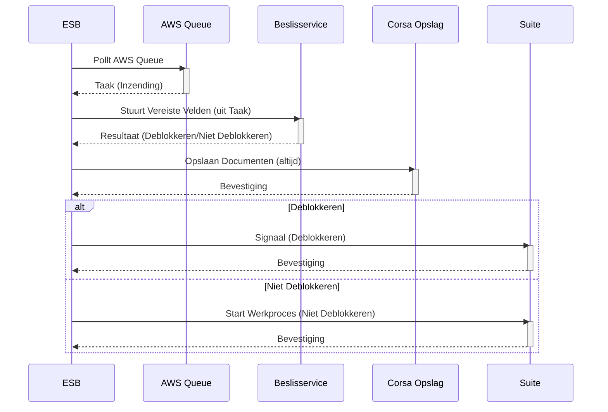

# ESF flows en data-formats:

We onderscheiden 3 processen in het ESF:
1. Klaarzetten nieuwe taken
2. Indienen formulier
3. Verwerken formulier in suite + corsa

## 1. Klaarzetten nieuwe taken
Maandelijks wordt een lijst uitgedraaid van deelnemers aan het elektronisch statusformulier. Op dit moment wordt de uitkering ook geblokkeerd.
Deze wordt voor de ESB klaargezet in CSV-format. 
Dit bestand bevat:
- BSN
- Dossiernr
- Periodenr
- E-mail
- Telefoonnummer (optioneel?)

Op basis van deze lijst worden taken klaargezet. Taken zijn technisch `objecten` in de `[object-api](https://mijn-services.nijmegen.nl/objects/api/v2/schema/)`.
De objecten bevatten alle relevante informatie.

## 2. Indienen formulier
De inwoner logt in op Mijn Nijmegen, waar de taak voor de inwoner klaarstaat. Deze bevat een verwijzing naar het statusformulier. Met deze link wordt
het statusformulier geopend, met vooringevuld de juiste gegevens uit de taak. De inwoner vult het formulier in en verzendt deze.
De ingezonden formuliergegevens eindigen:
**NB: Te maken keuze**
- In de taak (het object). Documenten worden via een referentie beschikbaar (? TODO: Check hoe dit werkt)
óf - Op een queue voor de ESB, met documenten in S3 (vgl huidig proces / nieuwe opzet Open Forms)
De taakstatus wordt hierbij aangepast naar 'ingediend' (TODO: Check taakstatus naamgeving)

## 3. Verwerken inzending
De ESB pakt de inzending op (afh. van keuze, ofwel van queue of adhv notificatie vanuit taak) en verwerkt deze. De **beslisservice** bepaalt of de 
uitkering kan worden gedeblokkeerd, adhv. antwoorden. Dit bepaalt wat in suite/corsa moet worden aangemaakt. (Gelijk aan oude opzet). Hierbij:
- Moeten documenten opgehaald (uit S3 of ZGW documenten)
- Moet gecontroleerd worden of contactinfo gewijzigd is (email/telefoonnr)
- Moet de taakstatus aangepast naar 'verwerkt' (TODO: Check naamgeving statussen)

