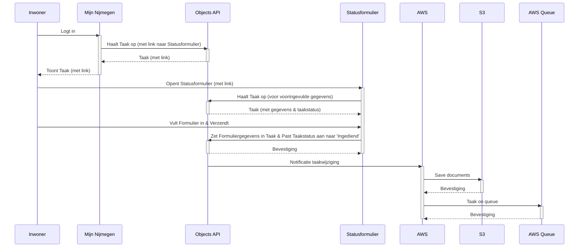

# ESF flows en data-formats:

We onderscheiden 3 processen in het ESF:
1. Klaarzetten nieuwe taken
2. Indienen formulier
3. Verwerken formulier in suite + corsa

## 1. Klaarzetten nieuwe taken
Maandelijks wordt een lijst uitgedraaid van deelnemers aan het elektronisch statusformulier. Op dit moment wordt de uitkering ook geblokkeerd.
Deze wordt voor de ESB klaargezet in CSV-format. 
Dit bestand bevat:
- BSN
- Dossiernr
- Periodenr
- E-mail
- Telefoonnummer (optioneel?)

Op basis van deze lijst worden taken klaargezet. Taken zijn technisch `objecten` in de `[object-api](https://mijn-services.nijmegen.nl/objects/api/v2/schema/)`.
De objecten bevatten alle relevante informatie.

## 2. Indienen formulier
De inwoner logt in op Mijn Nijmegen, waar de taak voor de inwoner klaarstaat. Deze bevat een verwijzing naar het statusformulier. Met deze link wordt
het statusformulier geopend, met vooringevuld de juiste gegevens uit de taak. De inwoner vult het formulier in en verzendt deze.

De ingezonden formuliergegevens worden door Open Forms in de taak gezet.
Op basis hiervan gaat een notificatie af (van objects API naar AWS):
- Een notificatie wordt op een queue gezet, waar de ESB op pollt, documenten worden in S3 gezet die in deze notificatie staat
De taakstatus wordt hierbij aangepast naar 'ingediend' door Open Forms

## 3. Verwerken inzending
De ESB pakt de inzending op (afh. van keuze, ofwel van queue of adhv notificatie vanuit taak) en verwerkt deze. De **beslisservice** bepaalt of de 
uitkering kan worden gedeblokkeerd, adhv. antwoorden. Dit bepaalt wat in suite/corsa moet worden aangemaakt. (Gelijk aan oude opzet). Hierbij:
- Moeten documenten opgehaald (uit S3 of ZGW documenten)
- Moet gecontroleerd worden of contactinfo gewijzigd is (email/telefoonnr)
- Moet de taakstatus aangepast naar 'verwerkt' (TODO: Check naamgeving statussen)

