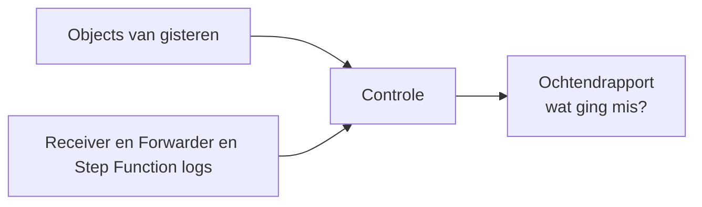
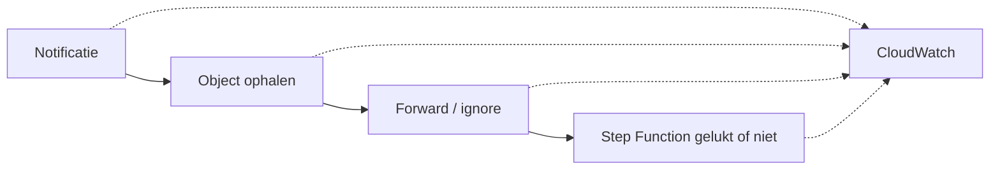
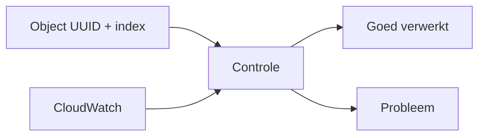

# Submission processing monitor

Hier komt de controle op de verwerking van Open Forms inzendingen.

Het einddoel is simpel: **iedere ochtend automatisch een betrouwbaar overzicht kunnen maken van wat de vorige dag niet goed verwerkt is.** Daarna kunnen we extra dingen per stuk toevoegen indien nodig.

Daarvoor moeten we per Object-versie kunnen zien:

* is de notificatie binnengekomen?
* kon het Object opgehaald worden?
* om welke UUID en index ging het?
* wat was bij ESF de interne status?
* had deze versie verwerkt moeten worden?
* is daarvoor een Step Function gestart?
* is die verwerking gelukt?



De monitor verandert zelf niets aan Objects en start geen verwerkingen opnieuw. Hij controleert alleen wat er gebeurd is.

## Eerst zorgen dat de logging klopt

Voordat we de monitor bouwen, moet de bestaande submission-forwarder goed genoeg te volgen zijn. En de log groups moeten gemakkelijk door de monitor opgehaald worden (naam uit statics)

We willen al een log hebben zodra een notificatie binnenkomt. Als daarna het ophalen van het Object mislukt, moet dat dus ook zichtbaar zijn.



Zodra informatie bekend is willen we minimaal kunnen zoeken op:

```text
objectUuid
objectIndex
objectType
reference (bijv. OF-nummer menselijk leesbaar)
esfStatus
executionArn
```

Voor ESF moet de interne status ook gelogd worden als die beschikbaar is.

De receiver en orchestrator krijgen vaste CloudWatch Log Group-namen via `Statics`, zodat de monitor later niet hoeft te gokken waar hij moet zoeken. Simpel doorgeven van log bron.

## Daarna de controle

Als de logging op orde is, kan de monitor de Objects van de vorige dag naast de logs leggen.



Daarbij moet bijvoorbeeld onderscheid gemaakt kunnen worden tussen:

```text
notificatie niet gezien (MISSING)
Object ophalen mislukt
Object genegeerd volgens de regels
Step Function niet gestart
Step Function mislukt
Step Function timed out
verwerking geslaagd (SUCCEED)
```

Voor ESF telt daarbij ook mee of de interne status überhaupt betekende dat het Object verwerkt moest worden.

## Het ochtendrapport

De uiteindelijke monitor draait dagelijks en controleert de vorige kalenderdag.

Het rapport moet vooral kort zijn. Geen technisch logdump, maar direct laten zien waar iemand naar moet kijken.

Bijvoorbeeld:

```text
Controle 30 augustus

428 Object-versies gecontroleerd
421 goed verwerkt

7 problemen:
- 2 notificaties niet teruggevonden
- 1 Object kon niet opgehaald worden
- 3 Step Functions mislukt
- 1 verwerking niet gestart
En de UUID's erbij enzo

ESF:
- 14 open
- 8 afgerond
- 8 verwerkt
- 0 onverwachte problemen
```

Bij ieder probleem moeten genoeg identifiers staan om direct in Objects en CloudWatch verder te zoeken.

Als de monitor zelf niet volledig heeft kunnen controleren, mag hij geen halve uitslag presenteren alsof die betrouwbaar is. Dan moet het rapport duidelijk zeggen dat de controle incompleet is.

## Wat zetten we nu alvast neer?

Deze eerste stap blijft klein:

* de map voor de monitor;
* een minimale CDK-class;
* SSM-parameters voor toegang tot de Objects API;
* de naam voor de gedeelde objecttypes-parameter;
* dit plan.

Er draait nog geen monitor.

De volledige eerdere te grote staat nog op feat/submission-processing-full. Daar halen we later alleen stukken uit terug die nog nuttig zijn.

## Parameters

Voor de monitor reserveren we:

```
objects-api-base-url
objects-api-token

```

Voor het geheel:
```
objecttypes
```

De nieuwe objecttypes paramater. Nu wordt er eentje aangemaakt in de receiver lambda, maar die is niet gemakkelijk te delen. Dus we maken er eenthje aan met een naam uit Statics die nu alleen door monitor gebruikt wordt en straks ook door receiver. Dan monitor je wat je wil receiven. Alleen uuid van objects, niet meer hele url (al eerder aangepast).

Het Objects API token is apart voor de monitor met de specifieke rechten voor alleen lezen en zorgen dat je rechten in kunt trekken voor de monitor indien nodig.


## Nog niet nu

Eerst deze basis naar productie. Daarna verbeteren we de logging van de submission-forwarder. Vervolgens bouwen we de dagelijkse controle en het ochtendrapport.
