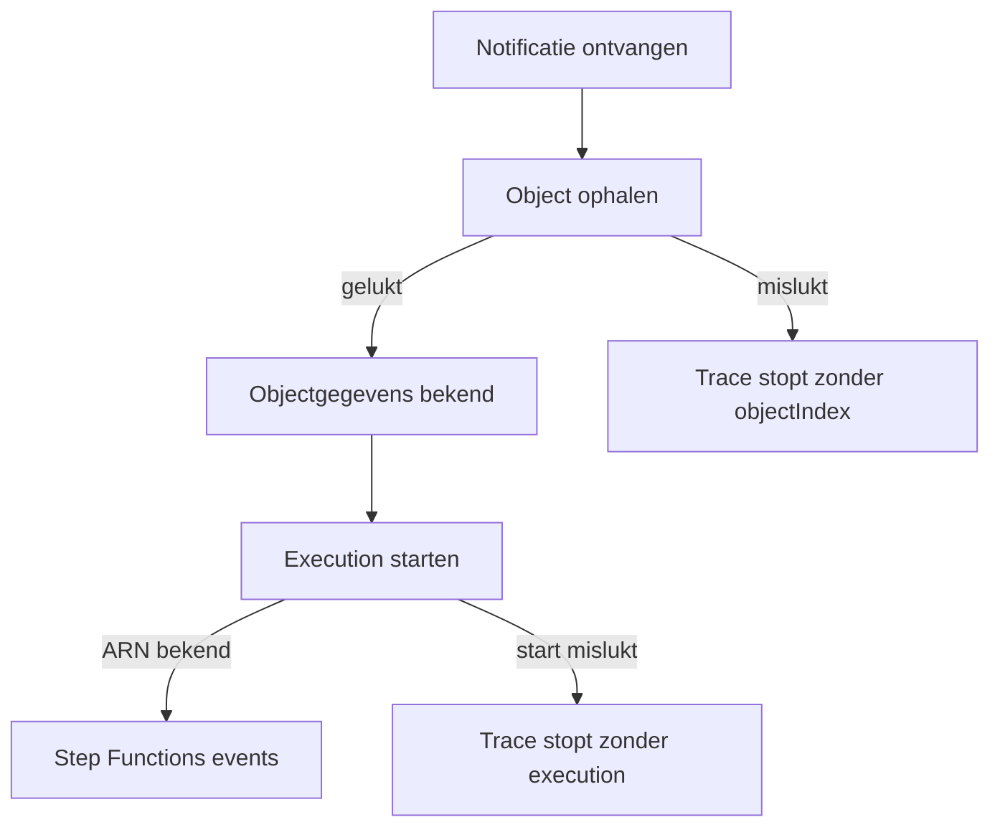
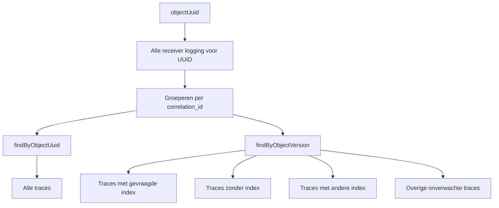
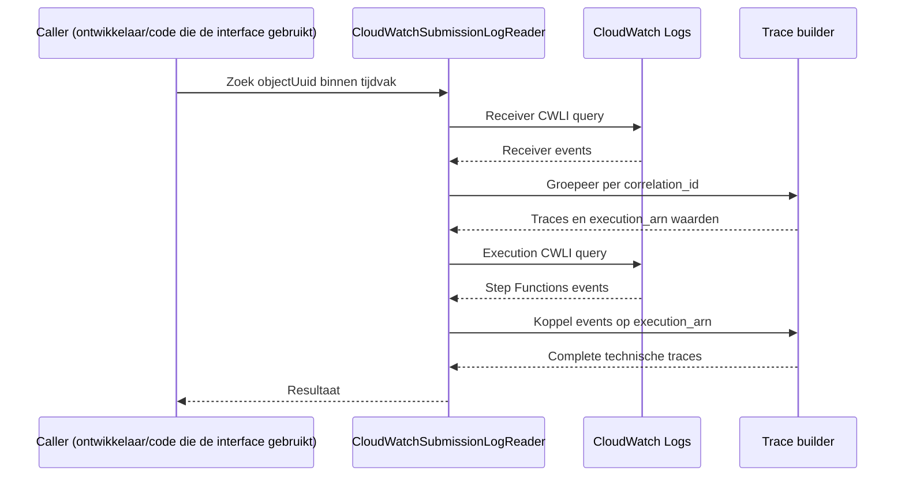

# CloudWatch Submission Log Reader

De CloudWatch Submission Log Reader haalt logging op voor één submission en zet losse CloudWatch-regels om in een bruikbare trace voor de rest van de monitor.

De reader trekt nog geen functionele conclusies. Hij zegt dus niet of een inzending goed verwerkt is. Dat gebeurt later in de matcher.
Haalt alleen op en geeft gestructureerd terug.


Voor nu buiten scope:
- Batch logs ophalen
- Met de diagnostics omgaan
- Conclusies trekken of een oordeel hebben over de logs

Wel nu nadrukkelijk:
- Helpers voor de datums en tijden. AWS heeft andere datums en tijden dan objects.
- Als het kan de queries ook met CDK opslaan om in de console te gebruiken (beperking bij sommige queries die niet met tags om kunnen gaan zoals joins)

Het is gebaseerd op een aantal test queries in de console.

## Wat de reader doet

De reader zoekt op objectUuid en haalt alle gevonden receiver-traces binnen een opgegeven tijdvak op.

Eén unieke correlation_id is één trace. Gegevens van verschillende correlation_id waarden worden nooit samengevoegd.

Een trace kan bijvoorbeeld bevatten:

- de ontvangen notificatie
- het ophalen van het Object
- de gevonden objectIndex
- parsing van het Object
- starten van de Step Function
- de execution_arn
- de CloudWatch-events van die execution
- timestamps en gelogde foutinformatie

Een trace kan ook vroeg stoppen. Bijvoorbeeld wanneer het Object niet opgehaald kon worden. In dat geval kan objectIndex ontbreken. Dat is nog steeds een geldige trace.



## Twee manieren van zoeken

Voor één Object zijn twee publieke zoekvormen voorzien.

findByObjectUuid haalt alle traces voor de UUID op.

findByObjectVersion zoekt op dezelfde UUID, maar deelt het resultaat daarna technisch in ten opzichte van de gevraagde objectIndex.



Bij zoeken op een specifieke objectIndex wordt niet meteen in CloudWatch op die index gefilterd. De eerste logregels kennen de index vaak nog niet. De reader zoekt daarom eerst op objectUuid en gebruikt daarna de gevonden feiten per correlation_id.

Een trace zonder objectIndex wordt nooit automatisch aan de gevraagde index gekoppeld.

## Hoe CloudWatch wordt gelezen

De reader gebruikt CWLI.

De runtime gebruikt voorlopig twee queryfasen:

1. receiver logging ophalen op objectUuid
2. gevonden execution_arn waarden gebruiken om Step Functions logging op te halen

De koppeling gebeurt daarna in TypeScript.



De fysieke Log Group namen worden niet als vast contract gebruikt. De bestaande shared tags worden gebruikt om de actuele receiver- en orchestratorgroepen te vinden.

De bestaande shared SubmissionLogging file blijft ook de bron voor eventnamen, veldnamen en tags. Deze reader maakt daar geen tweede kopie van.

## Resultaat

De kern van een trace blijft klein:

```ts
interface SubmissionLogTrace {
  correlation_id: string;
  objectUuid: string;
  objectIndexes: number[];

  firstSeen: Date;
  lastSeen: Date;

  receiverEvents: SubmissionReceiverLogEvent[];
  executions: SubmissionExecutionTrace[];
}
```

Bijvoorbeeld: Normaal verwachten we één objectIndex:

```
objectIndexes = [3]
```

Een vroege fout kan geen index hebben:

```
objectIndexes = []
```

Als onverwacht meerdere indexes binnen dezelfde correlation_id voorkomen, blijven die feiten zichtbaar:

```
objectIndexes = [3, 4]
```

De reader probeert dat niet te repareren. De matcher kan daar later betekenis aan geven.

## Receiver events

Receiver events blijven als afzonderlijke events beschikbaar. We reduceren de normale runtime-read dus niet alleen tot een summary.

Dat is nodig om later te kunnen zien welke processtappen werkelijk zijn aangetroffen.

De events worden oplopend op CloudWatch timestamp teruggegeven. Twee events met exact dezelfde timestamp hebben daarmee niet automatisch een gegarandeerde functionele onderlinge volgorde. Een matcher moet daarom niet alleen naar het laatste array-element kijken.

De volledige CloudWatch message wordt normaal niet meegenomen. Waar mogelijk bewaren we wel de CloudWatch record pointer, zodat een volledige logregel later gericht opgehaald kan worden voor debugging.

## Executions

Als een execution_arn is gevonden, wordt de bijbehorende Step Functions logging opgehaald.

Een bekende ARN zonder gevonden execution-events blijft zichtbaar als:

```ts
{
  execution_arn: 'arn:...',
  events: []
}
```

De reader concludeert daar niets uit. De matcher bepaalt later wat dit betekent.

Ook een Step Function die eindigt in ExecutionSucceeded is niet automatisch functioneel goed. Onderliggende fouten kunnen bijvoorbeeld opgevangen zijn. Daarom blijven de execution-events beschikbaar.

## Tijdvak

Iedere read heeft een begrensd absoluut tijdvak:

```ts
interface AbsoluteTimeRange {
  fromInclusive: Date;
  toExclusive: Date;
}
```

De reader doet zelf geen Europe/Amsterdam conversie.

Lokale kalenderdagen, zomer- en wintertijd en de omzetting naar absolute tijd krijgen een aparte module binnen submission-processing-monitor.

Het gebruikte tijdvak komt ook terug in het resultaat. Daardoor kan een latere matcher rekening houden met traces die mogelijk dicht tegen een querygrens liggen.

## Fouten

Een functioneel vreemde trace is gewone data.

Voorbeelden:

- geen objectIndex gevonden
- meerdere indexes binnen één correlation_id
- dubbele lifecycle-events
- execution_arn zonder gevonden execution-events

Een technisch onbetrouwbare CloudWatch-read is iets anders.

Voorbeelden:

- CWLI query failed
- CWLI query timeout
- resultaten niet volledig opgehaald
- Log Group discovery is ambigu
- queryresultaat kan niet betrouwbaar worden gemapt

In die gevallen geeft de reader geen gedeeltelijk normaal resultaat terug. Er wordt een duidelijke technische fout gegooid met genoeg context om het probleem terug te vinden en de reader verder te verbeteren.

De monitor bepaalt later via configuratie welke alarmcriticality daarbij hoort.

## Diagnostics

De publieke reader krijgt vanaf het begin een optionele diagnostics instelling. Hiermee kunnen we kosten en tijd beter in kaart brengen.

Diagnostics hebben lage prioriteit en worden pas later volledig gebouwd. Ze kunnen uiteindelijk informatie bevatten zoals queryId, recordsScanned, recordsMatched, bytesScanned en gebruikte Log Groups.

Normale functionele code mag niet afhankelijk zijn van diagnostics.

## Tests en samples

De tests zijn scenario-gericht.

Naast de testbestanden komt een samples map met kleine representatieve receiver(lambda)- en orchestrator(step function)logresultaten. Die samples kunnen later opnieuw gebruikt worden voor tests van de matcher en de volledige submission-processing-monitor en maken alles hopelijk ook leesbaarder voor een ontwikkelaar die voor het eerst de repo ziet.

De eerste belangrijke scenario's zijn:

- 1 normale succesvolle trace
- meerdere correlation_id traces voor dezelfde UUID
- verschillende objectIndexes voor dezelfde UUID
- meerdere pogingen voor dezelfde objectIndex
- fetch failure voordat objectIndex bekend is
- execution start failure
- execution_arn zonder execution-events
- meerdere indexes binnen 1 correlation_id
- dubbele receiver-events
- technische onvolledige CloudWatch-read


## Bewuste keuze CWLI

Met Cloudwatch kun je ook SQL of PPL gebruiken in plaats van CWLI.
CWLI heeft meer concurency (100 vs 15), de functies die we nodig hebben. Met name de log groepen met tags ophalen, filteren, joins, stats, subqueries en specifieke velden maken.
De logs die we hebben zijn niet altijd compleet gevuld, sommige properties kunnen undefined zijn, bijvoorbeeld esfStatus, en CWLI kan daar wat beter mee omgaan.
